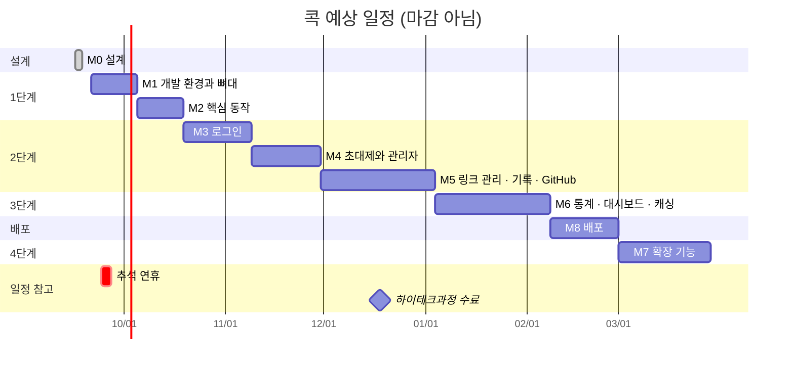
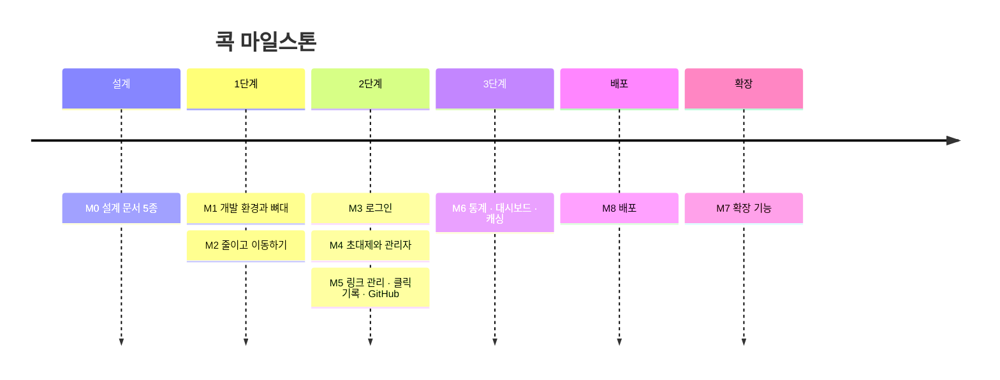
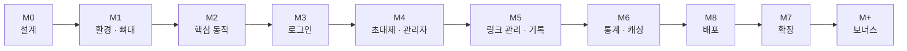

# 콕 (kkok) MILESTONES

> 버전: v0.2
> 작성일: 2026-09-17 (v0.2: 예상 일정 추가)
> 관련 문서: `01_requirements.md`, `02_architecture.md`, `03_erd.md`, `04_api-spec.md`, `05_uiux-design.md`
> 진행 기록: `DEVLOG.md`

---

## 0. 이 문서의 사용법

콕은 **기한 없이** 진행하는 자기계발 프로젝트다. 아래 날짜는 **마감이 아니라 방향을 잡기 위한 대략의 예상**이다.
날짜보다 각 마일스톤의 **"여기까지 되면 끝"이라는 완료 기준**이 우선이다.

- 마일스톤 하나 = 동작하는 결과물 하나
- 순서대로 진행한다. 앞 마일스톤의 완료 기준을 채우기 전에 다음으로 넘어가지 않는다.
- 막히면 **이전 마일스톤의 태그**로 돌아가 비교할 수 있다.
- GitHub 저장소의 **Milestones 기능**에 같은 이름으로 만들고, 각 작업을 Issue로 등록해 체크한다.
- 날마다의 진행 내용 · 막힌 문제 · 배운 점은 `DEVLOG.md`에 기록한다.
- 예상보다 많이 밀리면 날짜를 고치되, **완료 기준은 낮추지 않는다.**

### 0.1 일정 전제

| 항목 | 가정 |
|---|---|
| 시작일 | 2026-09-21 (월) |
| 작업 시간 | 평일 저녁 + 주말, 주 8~10시간 정도 |
| 고려한 일정 | 추석 연휴(9월 말), 하이테크과정 수료(12/18) 전후, 연말연시 |
| 여유 | 새로 배우는 개념이 많은 M3 · M5 · M6에 기간을 더 배정 |
| 순서 조정 | **M6(3단계) 후 바로 M8(배포)**, 그다음 M7(확장). 지인들이 먼저 써볼 수 있게 |

### 0.2 진행 현황

| 마일스톤 | 이름 | 단계 | 예상 기간 | 분량 | 상태 | 태그 |
|:-:|---|:-:|---|:-:|:-:|---|
| M0 | 설계 | - | ~ 2026-09-17 | - | ✅ 완료 | - |
| M1 | 개발 환경과 뼈대 | 1 | 09-21 ~ 10-04 | 2주 | 🟨 진행 중 | `v0.1.0` |
| M2 | 핵심 동작 (줄이고 이동하기) | 1 | 10-05 ~ 10-18 | 2주 | ⬜ 대기 | `v0.2.0` |
| M3 | 로그인 | 2 | 10-19 ~ 11-08 | 3주 | ⬜ 대기 | `v0.3.0` |
| M4 | 초대제와 관리자 | 2 | 11-09 ~ 11-29 | 3주 | ⬜ 대기 | `v0.4.0` |
| M5 | 링크 관리 · 클릭 기록 · GitHub 로그인 | 2 | 11-30 ~ 2027-01-03 | 5주 | ⬜ 대기 | `v0.5.0` |
| M6 | 통계 · 대시보드 · 캐싱 | 3 | 2027-01-04 ~ 02-07 | 5주 | ⬜ 대기 | `v0.6.0` |
| M8 | 배포 | 5 | 2027-02-08 ~ 02-28 | 3주 | ⬜ 대기 | `v1.0.0` |
| M7 | 확장 기능 | 4 | 2027-03-01 ~ 03-31 | 4주 | ⬜ 대기 | `v1.1.0` |
| M+ | 보너스 과제 | - | 2027-04 ~ | 자유 | ⬜ 선택 | - |

> M5는 하이테크과정 수료 시기와 연말이 겹쳐서 5주로 넉넉하게 잡았다.
> M8을 먼저 하므로 배포 버전이 `v1.0.0`, 이후 M7 확장 기능은 `v1.1.0`이 된다.

상태 표기: ⬜ 대기 · 🟨 진행 중 · ✅ 완료

---

## 1. 전체 흐름

### 1.1 예상 일정

### 1.2 단계 흐름

> **3단계까지 만든 상태로 먼저 배포**해서 지인들이 써보게 한 뒤 확장 기능을 붙인다. 실제 사용 피드백을 보고 M7의 우선순위를 조정할 수 있다.

---

## 2. 공통 완료 기준

모든 마일스톤에 공통으로 적용한다.

- [ ] 해당 마일스톤의 기능이 **로컬에서 처음부터 실행**된다 (`docker compose up` + 프론트 · 백엔드 실행)
- [ ] 새로 만든 핵심 로직에 **pytest 테스트**가 있고 모두 통과한다
- [ ] Swagger UI(`/docs`)에서 새 API를 직접 호출해 확인했다
- [ ] 설계와 다르게 구현한 부분은 **설계 문서를 먼저 고쳤다**
- [ ] `README.md`의 실행 방법이 최신이다
- [ ] `main` 브랜치에 병합하고 **태그**를 붙였다

### 2.1 Git 작업 규칙

| 항목 | 규칙 |
|---|---|
| 브랜치 | `main` + 작업별 브랜치 (`feat/link-create`, `fix/redirect-cache`) |
| 병합 | 혼자 하더라도 **Pull Request**로 병합 (변경 내용을 스스로 한 번 더 검토하는 연습) |
| 커밋 메시지 | `feat:` 기능 · `fix:` 수정 · `docs:` 문서 · `test:` 테스트 · `chore:` 설정 · `refactor:` 구조 개선 |
| 태그 | 마일스톤 완료 시 `v0.x.0` |
| 비밀값 | `.env`는 절대 커밋하지 않고, `.env.example`만 커밋 |

---

## M0. 설계 ✅

**목표**: 만들기 전에 무엇을, 어떻게 만들지 정한다.

- [x] 요구사항 정의서
- [x] 아키텍처 설계서
- [x] ERD 설계서
- [x] API 명세서
- [x] 화면 설계서
- [x] 서비스 이름 (콕), 포인트 컬러 (코랄 오렌지), 폰트 (Pretendard), 차트 (ECharts)

---

## M1. 개발 환경과 뼈대

> 예상: 2026-09-21 ~ 10-04

**목표**: 아무 기능은 없지만, 프론트 · 백엔드 · DB가 **서로 연결되어 켜지는** 상태를 만든다.

### 작업

**저장소**
- [x] GitHub 저장소 `kkok` 생성
- [x] `docs/` 폴더 구성 (설계 문서 5종, `DEVLOG`·`MILESTONES`·`README`는 저장소 루트 유지)
- [x] `.gitignore`, `.env.example`, `README.md` 작성
- [ ] `frontend/` 폴더 구성
- [x] `backend/` 폴더 구성

**인프라**
- [x] `docker-compose.yml`에 PostgreSQL 추가 (데이터는 볼륨에 저장)
- [x] `docker compose up`으로 DB 실행 확인

**백엔드**
- [x] Python 가상환경 · 의존성 관리 도구 설정
- [x] FastAPI 앱 뼈대 (`app/main.py`, `api/`, `services/`, `repositories/`, `models/`, `schemas/`, `core/`)
- [x] 설정 관리 (`core/config.py`, 환경변수에서 읽기)
- [x] async DB 연결 (`AsyncSession` + `asyncpg`)
- [x] 공통 에러 응답 형식과 예외 처리기
- [x] `GET /api/health` (DB 연결 확인 포함)
- [x] `alembic init -t async` 로 마이그레이션 초기화
- [x] pytest + async 플러그인 설정, health 테스트 1개

**프론트엔드**
- [ ] Vite + Vue 3 + TypeScript 프로젝트 생성
- [ ] Tailwind CSS + shadcn-vue 설치
- [ ] Pretendard 폰트, 코랄 오렌지 색상 변수, 다크모드 변수 적용
- [ ] Vue Router, Pinia 설치 및 기본 구성
- [ ] 레이아웃 3종 뼈대 (공개 · 인증 · 앱)
- [ ] `api/` 공통 요청 함수 (에러 형식 해석까지)
- [ ] Vite 프록시로 `/api` → 백엔드 연결
- [ ] 화면에 health 결과 표시 (연결 확인용 임시 화면)

### 완료 기준

- 브라우저에서 Vue 화면이 뜨고, 그 화면에 **"DB 연결: ok"**가 표시된다.
- 라이트 / 다크 모드를 전환하면 색이 바뀐다.
- `pytest`가 통과한다.

### 배울 개념

가상환경, 환경변수, Docker Compose 볼륨, async DB 연결, Vite 프록시, CSS 변수와 다크모드

---

## M2. 핵심 동작 — 줄이고 이동하기

> 예상: 2026-10-05 ~ 10-18

**목표**: 로그인 없이 **긴 주소를 넣으면 짧은 주소가 나오고, 누르면 이동**한다.

### 작업

**DB**
- [ ] 첫 마이그레이션: `links` 테이블 (`user_id` 없이 핵심 컬럼만)

**백엔드**
- [ ] 7자 무작위 코드 생성 (`secrets`) + 예약어 검사
- [ ] UNIQUE 충돌 시 재시도 (최대 3회)
- [ ] URL 검증 (형식, http/https, 자기 주소 금지, 최대 길이)
- [ ] `POST /api/links` (1단계는 공개)
- [ ] `GET /{code}` → 302 + `Cache-Control: no-store`
- [ ] 없는 코드 → `/notice/not-found`로 이동
- [ ] `/{code}` 라우트를 **가장 마지막에** 등록
- [ ] 테스트: 코드 생성 규칙, 예약어, URL 검증, 리다이렉트, 없는 코드

**프론트엔드**
- [ ] CMP-02 링크 생성 폼 + 결과 카드 (복사 버튼 포함)
- [ ] SCR-01 랜딩 화면
- [ ] SCR-12 안내 페이지 (`not-found`, `page-not-found`)
- [ ] 콕 버튼 · 결과 카드 · 복사 완료 Motion 연출
- [ ] 모바일 화면 확인

### 완료 기준

- 랜딩 화면에서 주소를 줄이고, 복사한 짧은 주소를 **새 탭에 붙여넣으면 원래 페이지로 이동**한다.
- 없는 짧은 주소는 안내 페이지가 뜬다.
- 잘못된 주소를 넣으면 입력칸 아래에 알맞은 문구가 뜬다.

### 배울 개념

암호학적 난수, UNIQUE 제약과 재시도, 302 vs 301, 라우트 등록 순서, Motion 기초, 클립보드 API

---

## M3. 로그인

> 예상: 2026-10-19 ~ 11-08

**목표**: 이메일로 **가입 · 로그인 · 로그아웃**이 되고, 새로고침해도 로그인이 유지된다.

### 작업

**인프라**
- [ ] `docker-compose.yml`에 **Redis** 추가 (로그인 시도 제한에 필요)

**DB**
- [ ] `users`, `refresh_tokens` 테이블

**백엔드**
- [ ] 비밀번호 해시 (argon2)
- [ ] JWT 발급 · 검증 (Access Token 15분)
- [ ] Refresh Token 발급 (2주, DB에 SHA-256 해시 저장)
- [ ] 쿠키 설정 (`HttpOnly`, `SameSite=Strict`, `Secure`는 설정값으로 제어, Refresh는 `Path=/api/auth`)
- [ ] `POST /api/auth/signup`, `login`, `logout`, `refresh`, `GET /api/auth/me`
- [ ] 현재 사용자 확인 의존성 (요청마다 DB에서 역할 · 정지 여부 확인)
- [ ] 로그인 실패 5회 잠금 (Redis `login_fail:{email}`)
- [ ] 테스트: 가입, 로그인 성공 · 실패, 잠금, 재발급, 로그아웃 후 재발급 실패

**프론트엔드**
- [ ] `authStore` (상태: loading · guest · authenticated)
- [ ] 앱 시작 시 `me` 확인 + 전체 로딩 화면
- [ ] 401 → 재발급 1회 → 재시도, 동시 요청 시 재발급 요청 하나로 묶기
- [ ] 라우터 가드 (비로그인 → 로그인 화면, `redirect`는 내부 경로만)
- [ ] SCR-02 로그인, SCR-03 회원가입
- [ ] CMP-01 앱 헤더 (사용자 메뉴, 로그아웃, 테마 전환)

### 완료 기준

- 가입 → 로그아웃 → 로그인 → **새로고침해도 로그인 유지**가 된다.
- Access Token 만료 시간을 임시로 1분으로 줄여도, 화면 사용이 끊기지 않는다. (자동 재발급 확인)
- 비밀번호를 5번 틀리면 잠금 문구가 뜬다.
- 개발자 도구에서 **JS로 토큰을 읽을 수 없음**을 확인했다. (`document.cookie`에 안 보임)

### 배울 개념

해시, JWT 구조, httpOnly 쿠키와 SameSite, Refresh Token, FastAPI 의존성 주입, Pinia, 내비게이션 가드, Redis 기초(INCR · EXPIRE)

---

## M4. 초대제와 관리자

> 예상: 2026-11-09 ~ 11-29

**목표**: 초대 코드를 받은 사람만 링크를 만들 수 있고, 관리자가 코드와 회원을 관리한다.

### 작업

**DB**
- [ ] `invite_codes` 테이블
- [ ] `links.user_id` 추가 → 기존 데이터 처리 → NOT NULL 적용 (**3단계 마이그레이션 연습**)

**백엔드**
- [ ] 관리자 지정 방법 (서버 설정 또는 관리 명령어)
- [ ] 권한 확인 의존성 (`member` 이상, `admin`)
- [ ] `POST /api/invites/redeem` (조건부 UPDATE 한 번으로 사용 처리)
- [ ] 초대 코드 실패 횟수 제한 (Redis `invite_fail:{user_id}`)
- [ ] `POST /api/links`를 **회원 전용**으로 변경
- [ ] `POST · GET /api/admin/invites`
- [ ] `GET /api/admin/users`, `PATCH /api/admin/users/{id}` (정지 시 전체 세션 로그아웃, 자기 자신 변경 금지)
- [ ] `POST /api/admin/users/{id}/reset-password`
- [ ] 테스트: 코드 사용 성공 · 실패, **동시에 같은 코드 사용 시 한 명만 성공**, 권한별 접근 차단

**프론트엔드**
- [ ] SCR-04 초대 코드 입력 (+ 성공 연출)
- [ ] 라우터 가드에 역할 규칙 추가
- [ ] SCR-10 초대 코드 관리 (발급 Dialog, 초대 문구 복사)
- [ ] SCR-11 회원 관리 (정지 확인, 임시 비밀번호 1회 표시)
- [ ] SCR-01에서 링크 생성 폼을 "시작하기" 버튼으로 교체

### 완료 기준

- 새로 가입한 계정은 링크를 만들 수 없고, 초대 코드를 입력하면 만들 수 있다.
- 두 브라우저에서 **같은 코드를 거의 동시에** 입력하면 한쪽만 성공한다.
- 정지된 회원은 다음 요청부터 바로 차단된다.

### 배울 개념

인증과 인가, 역할 기반 접근 제어, 동시성과 조건부 업데이트, 데이터가 있는 테이블의 마이그레이션, 트랜잭션

---

## M5. 링크 관리 · 클릭 기록 · GitHub 로그인

> 예상: 2026-11-30 ~ 2027-01-03

**목표**: 내 링크를 관리하고, 클릭이 기록되며, GitHub으로도 로그인할 수 있다.

### 작업

**DB**
- [ ] `links.is_active`, `links.deleted_at` 추가
- [ ] `link_clicks`, `social_accounts` 테이블

**백엔드 — 링크 관리**
- [ ] `GET /api/links` (검색 · 상태 · 정렬 · 페이지)
- [ ] `GET · PATCH · DELETE /api/links/{id}` (남의 링크는 404)
- [ ] 소프트 삭제 조건을 Repository 기본 조건으로
- [ ] 리다이렉트에 비활성 · 삭제 처리 추가 (`/notice/inactive`)

**백엔드 — 클릭 기록**
- [ ] 리다이렉트 후 `BackgroundTasks`로 기록
- [ ] User-Agent 분석 (기기 · 브라우저 · OS · 봇 판별)
- [ ] Referer에서 도메인만 추출
- [ ] 목록 응답에 `click_count` (봇 제외)
- [ ] 테스트: 기록 저장 실패해도 리다이렉트 성공

**백엔드 — GitHub 로그인**
- [ ] GitHub OAuth 앱 등록 (개발용)
- [ ] `GET /api/auth/github/login`, `callback` (state 쿠키 `SameSite=Lax`)
- [ ] verified 이메일 확인, 고유 번호로 회원 찾기, 신규 회원은 `pending`
- [ ] 테스트: 외부 요청은 가짜 응답으로 대체해서 검증

**프론트엔드**
- [ ] SCR-06 내 링크 목록 (표 · 카드 전환, 쿼리 동기화, 검색 지연 요청)
- [ ] 켜기/끄기 **낙관적 업데이트**
- [ ] CMP-03 삭제 확인, CMP-04 빈 상태 · 에러 상태
- [ ] SCR-08 링크 상세 (정보 · 켜기/끄기 · 삭제만, 통계 자리는 "준비 중")
- [ ] SCR-02 · 03에 GitHub 버튼 (페이지 이동 방식), 쿼리 에러 알림
- [ ] SCR-12에 `inactive` 추가

### 완료 기준

- 내 링크를 검색 · 끄기 · 삭제할 수 있고, 끈 링크를 누르면 안내 페이지가 뜬다.
- 짧은 링크를 PC · 폰에서 누르면 기록이 **기기별로** 쌓인다. (DB에서 직접 확인)
- GitHub으로 처음 로그인하면 초대 코드 화면이 나온다.
- 2단계 완료: 요구사항 F-01 ~ F-13 충족

### 배울 개념

페이지네이션, 소프트 삭제, 백그라운드 작업, User-Agent 파싱, OAuth 2.0 흐름, 외부 API 테스트 대역(mock), 낙관적 업데이트, 디바운스

---

## M6. 통계 · 대시보드 · 캐싱

> 예상: 2027-01-04 ~ 02-07

**목표**: 클릭 데이터를 **차트로 보고**, 리다이렉트가 빨라진다.

### 작업

**백엔드 — 통계**
- [ ] `stats/summary`, `timeseries`, `breakdown` (한국 시간 기준 집계, 0 채우기, "기타" 합치기)
- [ ] `GET /api/dashboard/summary`
- [ ] (선택) `stats/heatmap`
- [ ] 기간 제한 검증 (최대 366일, 시간별은 7일)
- [ ] 테스트: 날짜 경계(자정 전후), 빈 기간, 봇 제외

**백엔드 — 성능 · 제한**
- [ ] **캐싱 전** 리다이렉트 응답 시간 측정 · 기록
- [ ] Redis 리다이렉트 캐시 (`link:{code}`)
- [ ] 수정 · 삭제 · 비활성화 시 캐시 삭제
- [ ] **캐싱 후** 응답 시간 측정 · 비교 기록
- [ ] 링크 생성 횟수 제한 (`rate:link_create:{user_id}`)
- [ ] 테스트: 캐시 적중, 삭제 후 캐시로 이동되지 않음

**백엔드 — 계정 설정**
- [ ] `GET /api/auth/github/connect`, `DELETE /api/auth/github` (마지막 로그인 수단 해제 금지)
- [ ] `PATCH /api/auth/password` (설정 · 변경, 다른 세션 로그아웃)
- [ ] (선택) `GET · DELETE /api/auth/sessions`

**프론트엔드**
- [ ] ECharts 감싼 차트 부품 (추이 · 비율 · 히트맵), 다크모드 색상 연동
- [ ] CMP-05 기간 필터 (쿼리 동기화)
- [ ] SCR-08 통계 영역 (차트별 로딩 · 에러, **이전 요청 취소**)
- [ ] SCR-05 홈 대시보드 (숫자 카운트업, 인기 링크)
- [ ] SCR-09 계정 설정
- [ ] 3단계 완료 후 **라이트 · 다크 · 모바일 전체 화면 점검**

### 완료 기준

- 링크 상세에서 기간을 바꾸면 차트가 바뀌고, 빠르게 여러 번 바꿔도 **마지막 선택 결과**만 보인다.
- 캐싱 전후 측정 결과가 문서에 남아 있다.
- 링크를 끈 직후 짧은 주소를 누르면 **바로** 안내 페이지가 뜬다. (캐시 무효화 확인)
- 3단계 완료: 요구사항 F-14 ~ F-17 충족

### 배울 개념

집계 쿼리(GROUP BY, 날짜 함수), 시간대 처리, 캐시 전략과 무효화, 성능 측정, 요청 취소(AbortController), 차트 라이브러리 감싸기

---

## M8. 배포

> 예상: 2027-02-08 ~ 02-28 · M6 완료 직후 진행

**목표**: 지인들이 **인터넷에서 콕을 쓸 수 있다.**

### 작업

- [ ] GitHub Actions: 푸시마다 pytest 실행 (테스트용 PostgreSQL · Redis 포함)
- [ ] 백엔드 · 프론트엔드 Dockerfile (운영용)
- [ ] Nginx 설정 (`/api`, 예약어 경로, 짧은 코드 분배, 정적 파일)
- [ ] 운영용 `docker-compose` 구성, 비밀값 관리
- [ ] 서버 · 도메인 · HTTPS 준비
- [ ] 쿠키 `Secure` 활성화, GitHub OAuth 운영용 콜백 주소 등록
- [ ] DB 백업 방법 정리
- [ ] 첫 초대 코드 발급 → 지인 1명 가입 · 사용 확인

### 완료 기준

- 휴대폰 데이터망에서 짧은 링크를 눌러 이동된다.
- 지인이 초대 코드로 가입해 링크를 만들고 통계를 볼 수 있다.
- 푸시하면 GitHub Actions가 자동으로 테스트를 돌린다.

### 배울 개념

리버스 프록시, 컨테이너 운영, HTTPS, CI, 운영 환경 설정 분리

---

## M7. 확장 기능

> 예상: 2027-03-01 ~ 03-31 · M8(배포) 이후 진행

**목표**: 커스텀 주소 · 만료일 · 미리보기 · 메일 기능을 붙인다.

### 작업

- [ ] `links.expires_at`, `is_custom`, 미리보기 컬럼 추가
- [ ] 커스텀 주소 (허용 문자, 소문자 저장, 예약어 · 중복 검사)
- [ ] 만료일 (리다이렉트 조건, 캐시 만료 시간 조정, `/notice/expired`)
- [ ] 링크 미리보기 수집 (httpx, 시간 · 크기 제한, **내부망 주소 차단**)
- [ ] 메일 발송 연동 (SMTP)
- [ ] `auth_tokens` 테이블, 이메일 인증, 비밀번호 재설정
- [ ] SCR-13 · 14 · 15, CMP-02에 커스텀 주소 · 만료일 입력 추가

### 완료 기준

- 4단계 완료: 요구사항 F-18 ~ F-22 충족
- 내부망 주소(`http://localhost`, 사설 IP)로 미리보기 요청이 나가지 않음을 테스트로 확인했다.

### 배울 개념

SSRF 방어, HTML 메타 태그 파싱, 메일 발송, 1회용 토큰 설계

---

## M+. 보너스 과제

필요하거나 궁금해질 때 골라서 한다.

| 과제 | 배우는 것 |
|---|---|
| Refresh Token Rotation + 탈취 감지 | 토큰 보안 심화 |
| 클릭 기록을 Redis 대기열로 전환 | 메시지 큐, 유실 방지 |
| 만료 세션 · 오래된 데이터 정리 작업 | 주기적 작업(스케줄러) |
| QR 코드 | 프론트 라이브러리 연동 |
| 날짜별 클릭 집계 테이블 | 대량 데이터 최적화 |
| 프론트엔드 컴포넌트 테스트 | Vitest |
| 화면 전체 흐름 테스트 | Playwright (E2E) |
| 카카오 · 네이버 로그인 | `social_accounts` 확장 |
| 접근성 점검 | 스크린리더, 키보드 탐색 |
