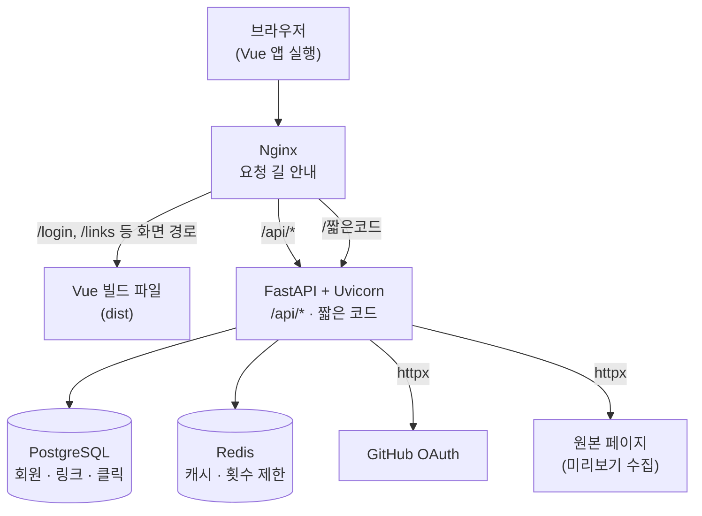
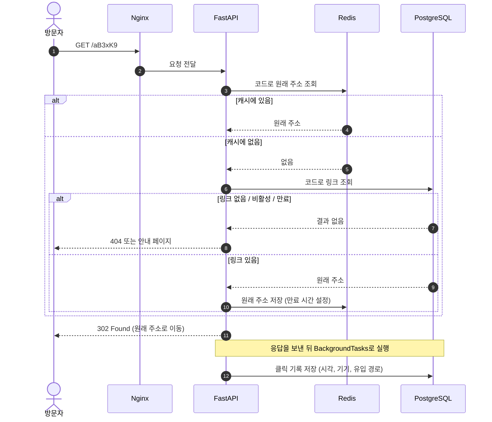
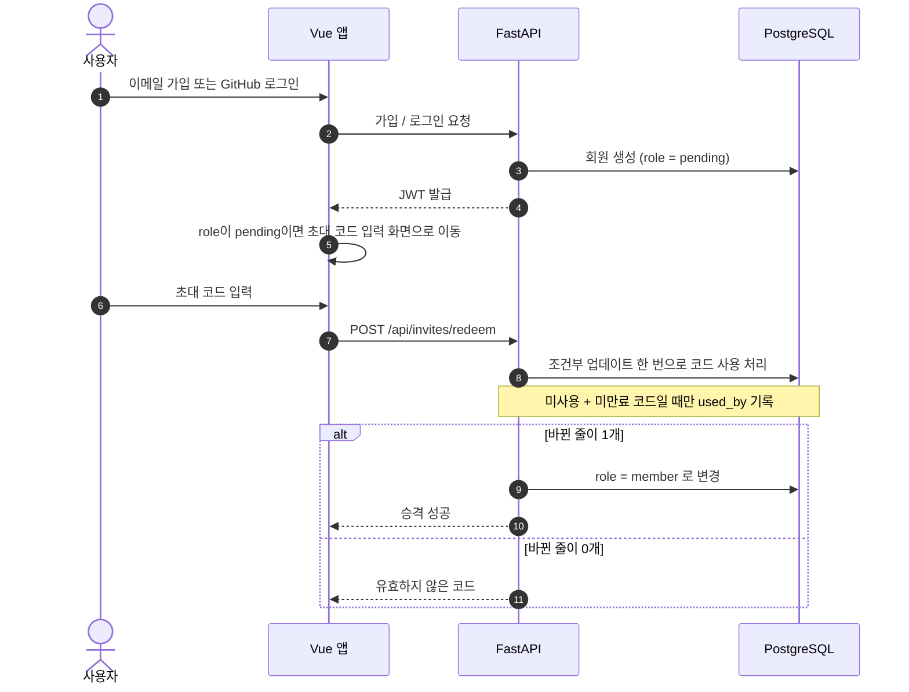
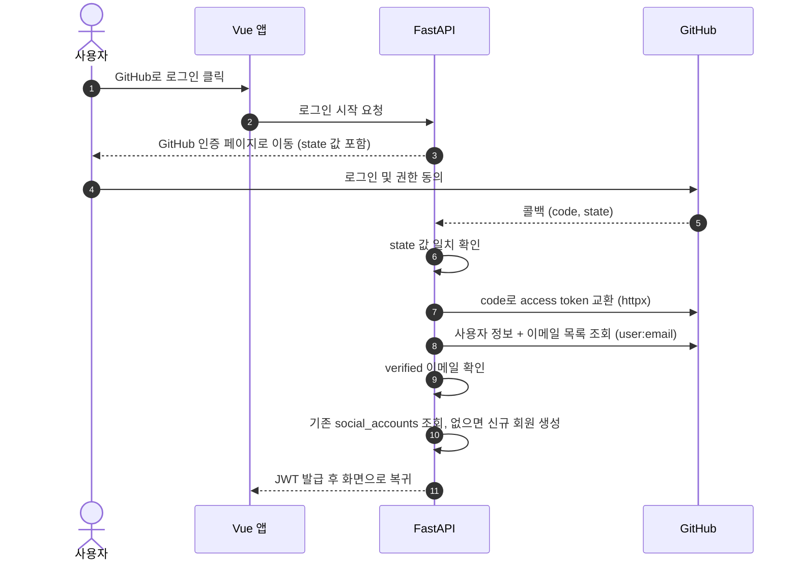
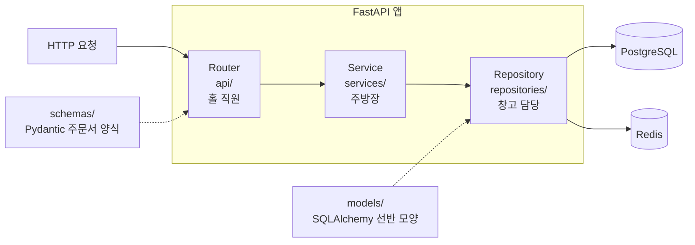
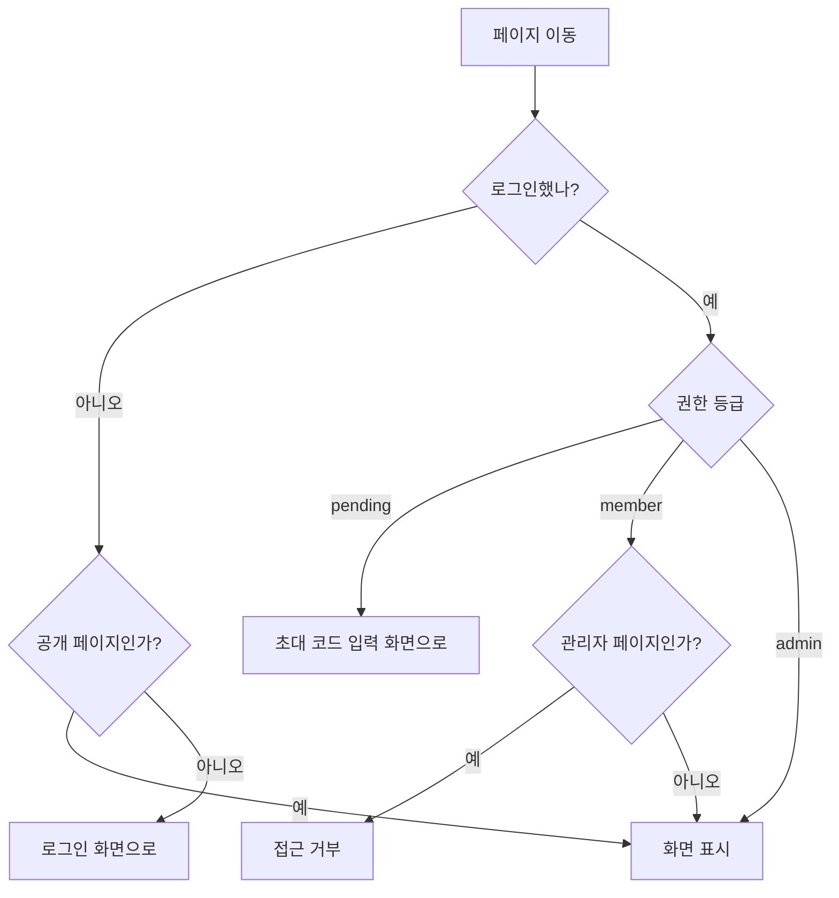
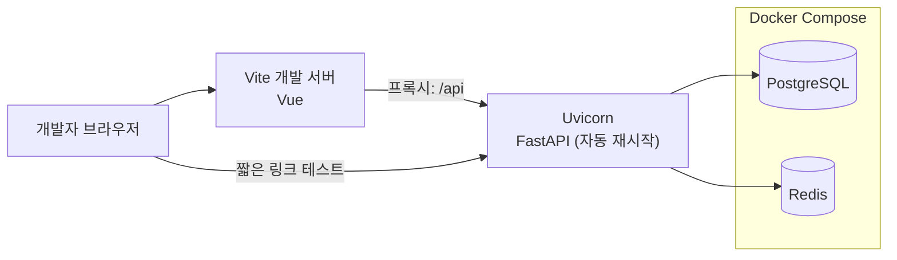
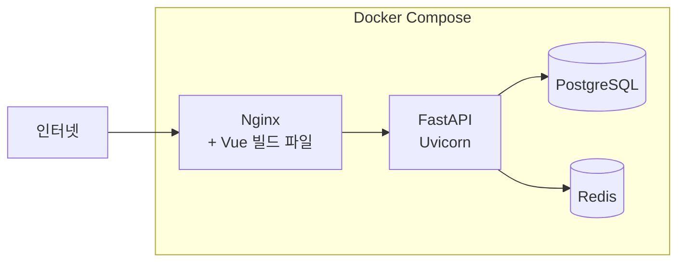
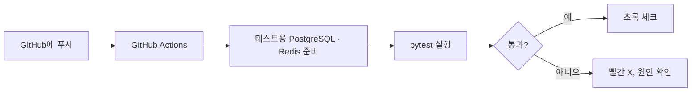

# 콕 (kkok) 아키텍처 설계서

> 버전: v0.1
> 작성일: 2026-09-16
> 관련 문서: `01_requirements.md`

---

## 1. 개요

아키텍처는 **서비스를 구성하는 부품이 무엇이고, 서로 어떻게 연결되는지**를 정리한 설계도다.
집으로 치면 방 배치도(ERD)보다 먼저 그리는 **전기·수도 배관도**에 해당한다.

### 1.1 구성 요소 요약

| 구성 요소 | 역할 | 비유 |
|---|---|---|
| 브라우저 (Vue 앱) | 사용자가 보는 화면 | 가게 진열대 |
| Nginx | 요청을 목적지별로 분배 | 건물 입구 안내 데스크 |
| FastAPI + Uvicorn | API 처리, 리다이렉트 | 가게 직원들 |
| PostgreSQL | 회원·링크·클릭 기록·초대 코드 영구 저장 | 창고 |
| Redis | 리다이렉트 캐시, 로그인 시도 제한, 생성 횟수 제한 | 책상 위 메모지 |
| 외부 서비스 | GitHub OAuth, 원본 페이지(미리보기 수집) | 거래처 |

---

## 2. 전체 시스템 구성도



---

## 3. 요청 분배 규칙 (Nginx)

| 요청 경로 | 목적지 | 예시 |
|---|---|---|
| `/api/*` | FastAPI | `/api/links`, `/api/auth/login` |
| 예약어 경로 | Vue 빌드 파일 | `/login`, `/signup`, `/links`, `/admin`, `/settings` |
| 그 외 한 단계 경로 | FastAPI (리다이렉트) | `/aB3xK9` |
| 정적 자원 | Vue 빌드 파일 | `/assets/*` |

### 3.1 경로 충돌 방지

짧은 코드와 Vue 화면 경로가 **둘 다 주소 맨 앞자리**를 사용한다.
커스텀 주소를 `login`으로 만들면 로그인 페이지가 가려지는 사고가 난다.

- **예약어 목록**을 두고, 짧은 코드(무작위 · 커스텀 모두)로 사용할 수 없게 막는다.
- 예약어 예: `api`, `login`, `signup`, `links`, `admin`, `settings`, `invite`, `assets`, `notice`, `docs`, `account`
- 이 검사는 **1단계부터** 적용한다 (커스텀 주소 기능이 없어도 무작위 코드가 우연히 겹칠 수 있음).

---

## 4. 핵심 흐름

### 4.1 짧은 링크를 "콕" 눌렀을 때 (리다이렉트)



**설계 포인트**

- **302 사용**: 301은 브라우저가 기억해버려 이후 클릭이 서버를 거치지 않으므로 클릭 수를 셀 수 없다.
- **응답 먼저, 기록은 나중에**: 음식부터 내주고 장부는 나중에 적는 방식. 기록 저장이 실패해도 이동은 정상 동작한다 (N-02).
- **알려진 약점**: `BackgroundTasks`는 서버가 그 순간 종료되면 기록이 유실될 수 있다. 학습 단계에서는 허용하고, 추후 Redis 대기열 방식으로 개선 가능.
- **캐시 무효화**: 링크를 삭제 · 비활성화 · 수정하면 Redis의 해당 캐시도 함께 삭제해야 한다. 안 그러면 지운 링크로 계속 이동된다.

### 4.2 가입부터 링크 생성 권한 얻기까지 (초대 코드)



**설계 포인트**

- 초대 코드는 **가입 후** 입력한다. 이메일 · GitHub 어느 쪽으로 가입해도 입력 창구가 하나로 통일되고, OAuth 왕복 중 코드를 보관할 필요가 없다.
- 코드 사용은 **확인과 사용 처리를 한 번의 업데이트**로 처리한다. 두 단계로 나누면 동시에 두 명이 같은 코드를 쓸 수 있다 (선착순 문제, F-10).
- 권한은 JWT에 담지 않고 요청마다 DB에서 확인하므로, 승격 즉시 링크 생성이 가능해진다.

### 4.3 GitHub 로그인 (OAuth)



**설계 포인트**

- `state` 값은 **다른 사이트가 로그인 흐름을 가로채는 공격(CSRF)**을 막기 위한 확인용 번호표다.
- GitHub 사용자는 이메일을 비공개로 둔 경우가 많아, 이메일 목록 API로 **verified 이메일**을 따로 확인한다.
- 이메일이 같아도 **자동 계정 병합은 하지 않는다**. 연결은 로그인 후 직접 한다 (F-17).

---

## 5. 백엔드 내부 구조

### 5.1 3층 구조



| 층 | 식당 비유 | 하는 일 | 하지 않는 일 |
|---|---|---|---|
| Router | 홀 직원 | 요청 받기, 입력 검증, 결과 응답 | 비즈니스 규칙 판단 |
| Service | 주방장 | 핵심 규칙 처리 (예: 초대 코드 유효하면 승격) | HTTP나 SQL을 직접 다루기 |
| Repository | 창고 담당 | DB · Redis 읽기/쓰기 | 규칙 판단 |

**층을 나누는 이유**

- 각 층의 책임이 명확해져서 코드 위치를 찾기 쉽다.
- Service를 테스트할 때 **가짜 Repository**를 끼워서 규칙만 검증할 수 있다 (pytest).

### 5.2 models와 schemas의 차이

| 구분 | 비유 | 역할 |
|---|---|---|
| `models/` (SQLAlchemy) | 창고 선반 모양 | DB에 어떻게 저장되는지 |
| `schemas/` (Pydantic) | 주문서 양식 | API로 무엇을 주고받는지 |

예: 비밀번호 해시는 선반(models)에는 있지만, 주문서(응답 schemas)에는 **절대 포함되지 않아야** 한다.

### 5.3 async 규칙

- DB: `AsyncSession` + `asyncpg`
- Redis: `redis.asyncio`
- 외부 요청: `httpx.AsyncClient`
- 마이그레이션: `alembic init -t async`
- 연결된 데이터는 조회 시점에 `selectinload` 등으로 **미리 함께** 불러온다. (`MissingGreenlet` 에러 예방)

---

## 6. 프론트엔드 구조

### 6.1 화면 목록

| 영역 | 화면 | 단계 |
|---|---|:---:|
| 공개 | 홈 (소개 + 링크 생성) | 1 |
| 공개 | 로그인 / 회원가입 | 2 |
| 대기 회원 | 초대 코드 입력 | 2 |
| 공개 | 404 / 비활성 / 만료 안내 | 1~4 |
| 회원 | 홈 대시보드 (전체 클릭 합계, 인기 링크) | 3 |
| 회원 | 내 링크 목록 | 2 |
| 회원 | 링크 상세 통계 | 3 |
| 회원 | 계정 설정 (GitHub 연결, 비밀번호 변경) | 3 |
| 관리자 | 초대 코드 관리 | 2 |
| 관리자 | 회원 관리 | 2 |
| 공개 | 이메일 인증 / 비밀번호 재설정 | 4 |

### 6.2 프론트엔드 볼거리 강화 아이디어 (선택)

- 통계 페이지: 기간 필터, 요일×시간대 히트맵, 링크 두 개 비교 차트
- "콕" 연출: 링크 생성 시 손가락이 누르는 Motion 애니메이션, 복사 완료 피드백
- 다크모드 + 모바일 대응
- QR 코드 표시

### 6.3 화면 접근 제어



- Vue Router의 **내비게이션 가드**로 구현하고, 로그인 상태와 권한은 Pinia에서 관리한다.
- 프론트의 접근 제어는 **편의 기능**일 뿐이다. 진짜 권한 검사는 반드시 백엔드에서 한다.

---

## 7. 저장소(폴더) 구조

```
kkok/
├─ frontend/                # Vue 3 + Vite
│  └─ src/
│     ├─ pages/             # 화면 단위
│     ├─ components/        # shadcn-vue 포함 UI 부품
│     ├─ stores/            # Pinia
│     ├─ router/            # Vue Router + 내비게이션 가드
│     └─ api/               # 백엔드 호출 함수 모음
├─ backend/                 # FastAPI
│  ├─ app/
│  │  ├─ api/               # Router 층
│  │  ├─ services/          # Service 층
│  │  ├─ repositories/      # Repository 층
│  │  ├─ models/            # SQLAlchemy 모델
│  │  ├─ schemas/           # Pydantic 스키마
│  │  ├─ core/              # 설정, 보안, DB · Redis 연결
│  │  └─ main.py
│  ├─ alembic/              # 마이그레이션
│  └─ tests/                # pytest
├─ docker-compose.yml
└─ .github/workflows/       # GitHub Actions
```

---

## 8. 실행 환경

### 8.1 개발 환경



- DB와 Redis만 Docker Compose로 띄우고, 프론트 · 백엔드는 로컬에서 직접 실행한다.
- Vite 설정의 **프록시**로 `/api` 요청을 백엔드에 넘기므로 Nginx 없이 개발 가능하다.

### 8.2 배포 환경



### 8.3 CI



---

## 9. 아키텍처 결정 기록

| 항목 | 결정 | 이유 |
|---|---|---|
| 저장소 구성 | 프론트 · 백엔드 한 저장소 (`kkok/`) | 혼자 개발하는 학습 프로젝트라 관리가 단순함 |
| 요청 분배 | Nginx가 `/api`, 짧은 코드, 화면 파일로 분배 | 한 도메인에서 모든 기능 제공 |
| 경로 충돌 | 예약어 목록으로 방지 (1단계부터) | 짧은 코드와 화면 경로가 같은 자리를 씀 |
| 리다이렉트 | 302 + Redis 캐시 우선 조회 | 클릭 집계 가능, 조회 속도 확보 |
| 클릭 기록 | 응답 후 `BackgroundTasks` | 기록 실패가 이동을 막지 않게 |
| 백엔드 구조 | Router → Service → Repository | 책임 분리, 테스트 용이 |
| 비동기 | DB · Redis · 외부 요청 모두 async | 동시 요청이 많은 서비스 특성 |
| 초대 코드 | 가입 후 입력, 조건부 업데이트 한 번으로 사용 처리 | 입력 창구 통일, 동시 사용 방지 |
| 권한 검사 | 프론트는 편의용, 백엔드가 최종 판단 | 프론트 검사는 우회 가능 |
| 인증 토큰 | httpOnly 쿠키, Access 15분 + Refresh 2주(DB 저장) | XSS 토큰 탈취 방지, 기기별 로그아웃 가능 |

---

## 10. 미정 사항 (ERD 단계에서 결정)

- [x] ~~짧은 코드 생성 방식~~ → 무작위 문자열 7자 (`03_erd.md` 1장)
  - 무작위: 주소 예측이 어렵지만 중복 검사 필요
  - 번호 변환: 중복이 없지만 순서가 보여 다른 링크를 훑어보기 쉬움
- [x] ~~JWT 보관 위치와 재발급 방식~~ → httpOnly 쿠키 + DB 저장 Refresh Token (`03_erd.md` 9장)
- [x] ~~권한 변경 시 기존 JWT 처리 방식~~ → 권한은 요청마다 DB에서 확인
- [ ] Redis 캐시 만료 시간
- [ ] 로그인 시도 제한 · 생성 횟수 제한의 구체적 수치
- [x] 차트 라이브러리 최종 선택 (**ECharts** vs ~~ApexCharts~~)
