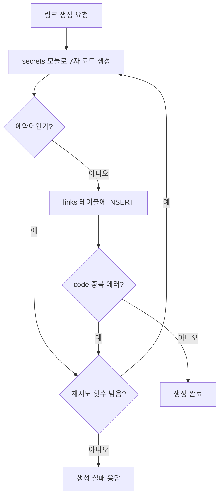
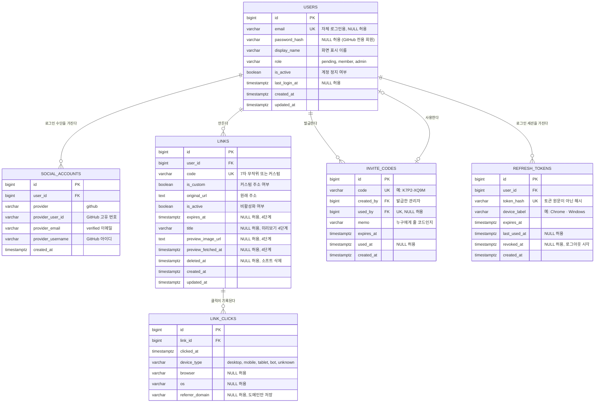
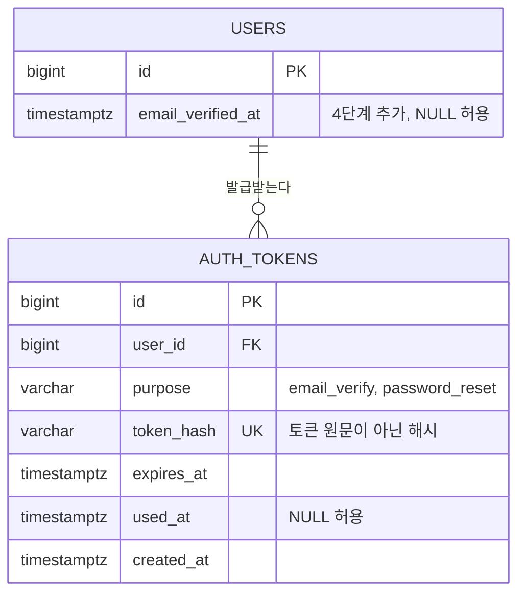
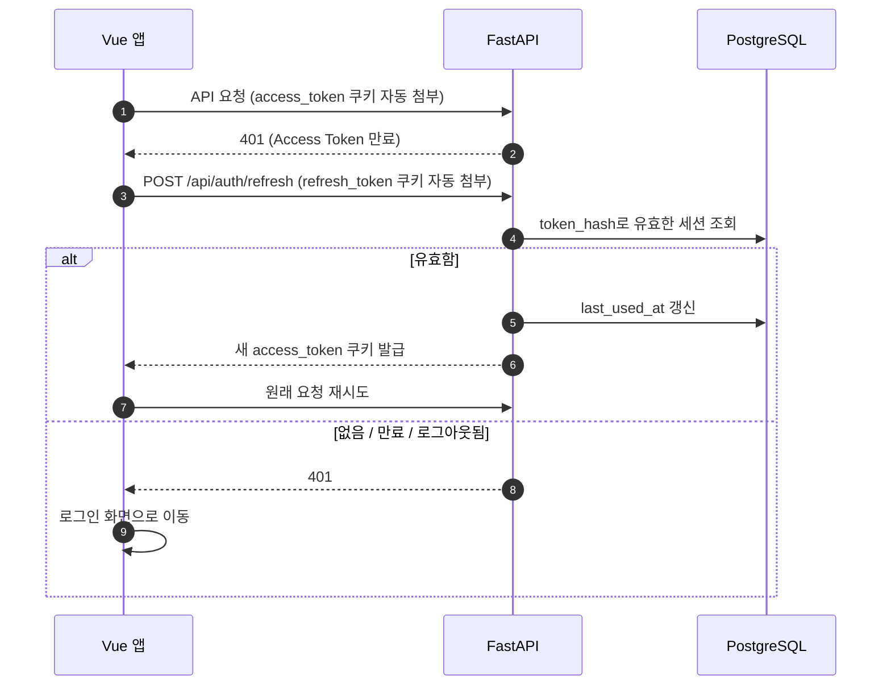

# 콕 (kkok) ERD 설계서

> 버전: v0.2
> 작성일: 2026-09-17 (v0.2: 인증 토큰 방식 확정, `refresh_tokens` 추가)
> 관련 문서: `01_requirements.md`, `02_architecture.md`

---

## 1. 이번 단계에서 결정한 것

| 항목 | 결정 | 이유 |
|---|---|---|
| 짧은 코드 생성 방식 | **무작위 문자열** | 주소를 예측할 수 없어 남의 링크를 훑어보기 어렵다 |
| 코드 문자 구성 | Base62 (`0-9`, `a-z`, `A-Z`) | URL에 그대로 쓸 수 있는 문자만 사용 |
| 코드 길이 | **7자** | 경우의 수 약 3.5조(62^7). 6자로도 충분하지만, 무작위로 주소를 찔러보는 시도를 더 어렵게 하기 위해 1자 여유 |
| 대소문자 | 구분함 | `aB3` 와 `AB3` 는 다른 코드 (PostgreSQL 기본 비교가 대소문자 구분) |
| 기본 키(PK) 타입 | `BIGINT` 자동 증가 | 외부에 노출되는 건 짧은 코드이고, 내부 번호는 단순한 게 다루기 쉽다 |
| 시간 저장 | `TIMESTAMPTZ`, UTC 기준 | 시간대 혼동 방지. 화면에서 한국 시간으로 변환 |
| 권한 등급 저장 | `VARCHAR` + `CHECK` 제약 | PostgreSQL ENUM 타입은 값 추가 시 마이그레이션이 번거롭다 |
| 링크 삭제 | **소프트 삭제** (`deleted_at`) | 삭제된 코드를 **재사용하지 않기 위해**. 재사용하면 예전에 퍼진 링크가 다른 사람의 새 링크로 이동하는 사고가 난다 |
| 로그인 시도 · 생성 횟수 제한 | **DB가 아니라 Redis** | 금방 사라지는 임시 숫자라 창고(DB)가 아니라 메모지(Redis)에 적는다 |
| 토큰 보관 위치 | **httpOnly 쿠키** | JS가 읽을 수 없어 XSS로 토큰을 훔쳐갈 수 없다. CSRF는 `SameSite`로 방어 |
| 토큰 구성 | Access Token(15분) + Refresh Token(2주) | 짧은 토큰으로 요청하고, 긴 토큰은 재발급에만 사용 |
| Refresh Token 관리 | **DB에 해시로 저장** | 기기별 로그아웃 · 강제 로그아웃 가능. Rotation은 나중 과제 |
| 권한 정보 | Access Token에 담지 않고 **요청마다 DB에서 확인** | 초대 코드로 승격되거나 정지되면 즉시 반영된다 |

### 1.1 무작위 코드 생성 절차



- 코드 생성에는 예측 가능한 `random` 이 아니라 **`secrets`** 모듈을 쓴다.
- "중복인지 먼저 조회 → 없으면 INSERT" 방식은 그 사이에 다른 요청이 끼어들 수 있다. 그래서 **`UNIQUE` 제약에 맡기고, 중복 에러가 나면 새 코드로 재시도**한다. (초대 코드 선착순 문제와 같은 원리)
- 재시도 횟수는 3회 정도로 제한한다. 경우의 수가 커서 실제로 재시도가 일어날 일은 거의 없다.

---

## 2. 전체 ERD (1~3단계)



---

## 3. 테이블 상세

### 3.1 `users` — 회원

| 컬럼 | 타입 | NULL | 기본값 | 설명 |
|---|---|:---:|---|---|
| `id` | BIGINT | X | 자동 증가 | PK |
| `email` | VARCHAR(255) | O | | 자체 로그인 이메일. UNIQUE |
| `password_hash` | VARCHAR(255) | O | | argon2/bcrypt 해시. GitHub 전용 회원은 NULL |
| `display_name` | VARCHAR(50) | X | | 화면 표시 이름 |
| `role` | VARCHAR(20) | X | `'pending'` | `CHECK (role IN ('pending','member','admin'))` |
| `is_active` | BOOLEAN | X | `true` | false면 로그인 불가 |
| `last_login_at` | TIMESTAMPTZ | O | | 마지막 로그인 |
| `created_at` | TIMESTAMPTZ | X | `now()` | |
| `updated_at` | TIMESTAMPTZ | X | `now()` | |

**왜 `email`이 NULL을 허용하나?**

`users.email`은 **자체 로그인용 이메일**만 담는다. GitHub으로만 가입한 회원은 이 칸이 비어 있고, GitHub 이메일은 `social_accounts.provider_email`에 따로 저장한다.

이렇게 나눈 이유는 "이메일이 같아도 자동으로 합치지 않는다"는 결정 때문이다. 만약 GitHub 이메일도 `users.email`에 넣으면, 같은 이메일로 자체 가입한 사람이 이미 있을 때 UNIQUE 제약에 걸려 GitHub 가입 자체가 막힌다.

> PostgreSQL의 UNIQUE 제약은 NULL 여러 개를 허용하므로, GitHub 전용 회원이 여러 명이어도 문제없다.

**추가 제약**

- 로그인 수단이 하나도 없는 회원이 생기면 안 된다. (`password_hash`도 없고 `social_accounts`도 없는 상태) → DB 제약으로 막기 어려우므로 **Service 층에서 검사**한다. 예: GitHub 연결 해제 시 비밀번호가 없으면 해제 거부.
- 이메일은 저장 전에 **소문자로 정규화**한다. (`Minkyu@x.com` 과 `minkyu@x.com` 을 같은 이메일로 취급)

### 3.2 `social_accounts` — 소셜 로그인 연결

| 컬럼 | 타입 | NULL | 설명 |
|---|---|:---:|---|
| `id` | BIGINT | X | PK |
| `user_id` | BIGINT | X | FK → `users.id`, 회원 삭제 시 함께 삭제(CASCADE) |
| `provider` | VARCHAR(20) | X | 현재는 `'github'`만. 나중에 `'kakao'` 등 추가 |
| `provider_user_id` | VARCHAR(100) | X | 제공사가 주는 고유 번호 |
| `provider_email` | VARCHAR(255) | O | 제공사에서 확인한 verified 이메일 |
| `provider_username` | VARCHAR(100) | O | GitHub 아이디 (화면 표시용) |
| `created_at` | TIMESTAMPTZ | X | 연결 시각 |

**UNIQUE 제약**

- `(provider, provider_user_id)`: 같은 GitHub 계정이 두 회원에 연결될 수 없다.
- `(user_id, provider)`: 한 회원은 GitHub 계정을 하나만 연결할 수 있다.

**GitHub 아이디(username)가 아니라 고유 번호로 찾는 이유**

GitHub 아이디는 사용자가 바꿀 수 있다. 바뀌지 않는 고유 번호(`provider_user_id`)로 회원을 찾아야 아이디 변경 후에도 같은 사람으로 인식한다.

**저장하지 않는 것**

- GitHub access token: 로그인 직후 사용자 정보를 받아오는 데만 쓰고 버린다. 저장하지 않으면 유출될 일도 없다.

### 3.3 `links` — 짧은 링크

| 컬럼 | 타입 | NULL | 기본값 | 설명 |
|---|---|:---:|---|---|
| `id` | BIGINT | X | 자동 증가 | PK |
| `user_id` | BIGINT | X | | FK → `users.id` |
| `code` | VARCHAR(32) | X | | UNIQUE. 무작위는 7자, 커스텀은 최대 32자 |
| `is_custom` | BOOLEAN | X | `false` | 커스텀 주소 여부 |
| `original_url` | TEXT | X | | 원래 주소 (http/https만) |
| `is_active` | BOOLEAN | X | `true` | 비활성화 시 이동 안 됨 |
| `expires_at` | TIMESTAMPTZ | O | | 4단계. 만료 시각 |
| `title` | VARCHAR(300) | O | | 4단계. 원본 페이지 제목 |
| `preview_image_url` | TEXT | O | | 4단계. 원본 대표 이미지 주소 |
| `preview_fetched_at` | TIMESTAMPTZ | O | | 4단계. 미리보기 수집 시각 |
| `deleted_at` | TIMESTAMPTZ | O | | 소프트 삭제 시각 |
| `created_at` | TIMESTAMPTZ | X | `now()` | |
| `updated_at` | TIMESTAMPTZ | X | `now()` | |

**코드 규칙**

| 구분 | 허용 문자 | 길이 | 대소문자 |
|---|---|---|---|
| 무작위 | `0-9 a-z A-Z` | 7 | 구분 |
| 커스텀 (4단계) | `a-z 0-9 -` | 3~32 | 소문자로 저장 |

- 예약어 검사는 **대소문자 무시**로 한다. (`Login`, `LOGIN` 도 막음)
- 커스텀 코드는 7자 무작위 코드와 모양이 겹칠 수 있지만, 같은 `code` 컬럼의 UNIQUE 제약이 중복을 막아준다.

**리다이렉트 가능 조건**

```
deleted_at IS NULL
AND is_active = true
AND (expires_at IS NULL OR expires_at > now())
```

**소프트 삭제 주의사항**

- 목록 조회 시 `deleted_at IS NULL` 조건을 **빼먹지 않도록** Repository 층에서 기본 조건으로 넣는다.
- 삭제 · 비활성화 · 주소 수정 시 Redis 캐시(`link:{code}`)도 함께 지운다.

### 3.4 `link_clicks` — 클릭 기록

| 컬럼 | 타입 | NULL | 설명 |
|---|---|:---:|---|
| `id` | BIGINT | X | PK |
| `link_id` | BIGINT | X | FK → `links.id` |
| `clicked_at` | TIMESTAMPTZ | X | 클릭 시각 (기본값 `now()`) |
| `device_type` | VARCHAR(20) | X | `desktop` / `mobile` / `tablet` / `bot` / `unknown` |
| `browser` | VARCHAR(50) | O | 예: Chrome, Safari |
| `os` | VARCHAR(50) | O | 예: Windows, iOS |
| `referrer_domain` | VARCHAR(255) | O | 유입 경로의 **도메인만** (예: `github.com`). 직접 입력이면 NULL |

**개인정보 최소 수집 (N-04)**

- IP 주소: 저장하지 않음
- User-Agent 원문: 저장하지 않고, 분석한 결과(기기 · 브라우저 · OS)만 저장
- Referer 원문: 전체 주소에는 검색어 등 개인정보가 섞일 수 있어 **도메인만** 저장

**봇 클릭**

메신저 · SNS가 링크 미리보기를 만들려고 자동으로 접속하는 경우가 많다. 이런 접속은 `device_type = 'bot'`으로 저장하고, 통계 화면에서는 기본적으로 제외한다.

**데이터 증가 대비**

클릭 기록은 테이블 중 가장 빨리 커진다. 학습 단계에서는 인덱스로 충분하고, 나중에 필요하면 날짜별 집계 테이블이나 파티셔닝을 검토한다.

### 3.5 `invite_codes` — 초대 코드

| 컬럼 | 타입 | NULL | 설명 |
|---|---|:---:|---|
| `id` | BIGINT | X | PK |
| `code` | VARCHAR(20) | X | UNIQUE. 예: `K7P2-XQ9M` |
| `created_by` | BIGINT | X | FK → `users.id` (발급한 관리자) |
| `used_by` | BIGINT | O | FK → `users.id`. UNIQUE (한 회원은 코드 하나만 사용) |
| `memo` | VARCHAR(100) | O | 누구에게 줄 코드인지 메모 |
| `expires_at` | TIMESTAMPTZ | X | 만료 시각 |
| `used_at` | TIMESTAMPTZ | O | 사용 시각 |
| `created_at` | TIMESTAMPTZ | X | 발급 시각 |

**초대 코드 형식**

- 헷갈리는 문자(`0/O`, `1/I/L`)를 뺀 **대문자 + 숫자**로 만들고, 가운데에 `-` 를 넣어 읽기 쉽게 한다.
- 입력받을 때는 대문자로 바꾸고 `-` 와 공백을 정리한 뒤 비교한다.

**선착순 사용 처리 (F-10)**

```sql
UPDATE invite_codes
SET used_by = :user_id, used_at = now()
WHERE code = :code
  AND used_by IS NULL
  AND expires_at > now()
RETURNING id;
```

- 돌려받은 줄이 있으면 성공 → 같은 트랜잭션 안에서 `users.role = 'member'` 로 변경
- 돌려받은 줄이 없으면 실패 (없는 코드 / 이미 사용 / 만료)

### 3.6 `refresh_tokens` — 로그인 세션

| 컬럼 | 타입 | NULL | 설명 |
|---|---|:---:|---|
| `id` | BIGINT | X | PK |
| `user_id` | BIGINT | X | FK → `users.id`, CASCADE |
| `token_hash` | VARCHAR(64) | X | UNIQUE. 토큰 원문의 SHA-256 해시 |
| `device_label` | VARCHAR(100) | O | 로그인한 기기 요약 (User-Agent 분석 결과만) |
| `expires_at` | TIMESTAMPTZ | X | 발급 후 2주 |
| `last_used_at` | TIMESTAMPTZ | O | 마지막 재발급 시각 |
| `revoked_at` | TIMESTAMPTZ | O | 로그아웃 · 강제 로그아웃 시각 |
| `created_at` | TIMESTAMPTZ | X | 로그인 시각 |

**왜 원문이 아니라 해시로 저장하나?**

`auth_tokens`와 같은 이유다. DB가 유출돼도 해시만으로는 재발급을 요청할 수 없다. 비밀번호와 달리 토큰은 충분히 긴 무작위 값이라 느린 해시(argon2)가 아니라 **빠른 해시(SHA-256)**로 충분하다.

**유효한 세션 조건**

```
token_hash = :hash
AND revoked_at IS NULL
AND expires_at > now()
```

**설계 포인트**

- 로그인 1회 = 행 1개. 한 회원이 PC · 폰에서 각각 로그인하면 행이 2개 생긴다.
- 로그아웃은 행을 지우지 않고 `revoked_at`을 기록한다. (나중에 Rotation의 탈취 감지에 활용)
- 관리자가 회원을 정지하면 그 회원의 모든 세션에 `revoked_at`을 기록한다.
- 만료된 행은 쌓이기만 하므로, 나중에 주기적으로 정리하는 작업을 붙인다.
- **Rotation을 붙일 때** `replaced_by_id` 컬럼을 추가해 "이 토큰이 어떤 토큰으로 교체됐는지"를 기록한다.

---

## 4. 인덱스

| 테이블 | 인덱스 | 용도 |
|---|---|---|
| `users` | `email` UNIQUE | 로그인 조회 |
| `social_accounts` | `(provider, provider_user_id)` UNIQUE | GitHub 로그인 시 회원 찾기 |
| `social_accounts` | `(user_id, provider)` UNIQUE | 연결 중복 방지 |
| `links` | `code` UNIQUE | **리다이렉트 조회 (가장 중요)** |
| `links` | `(user_id, created_at)` | 내 링크 목록 최신순 |
| `link_clicks` | `(link_id, clicked_at)` | 링크별 · 기간별 통계 |
| `invite_codes` | `code` UNIQUE | 코드 입력 조회 |
| `invite_codes` | `used_by` UNIQUE | 한 회원 한 코드 |
| `refresh_tokens` | `token_hash` UNIQUE | 재발급 시 세션 확인 |
| `refresh_tokens` | `user_id` | 기기 목록 조회, 전체 로그아웃 |

> FK 컬럼은 PostgreSQL이 인덱스를 자동으로 만들어주지 않는다. 조회에 쓰는 FK는 위처럼 직접 인덱스를 건다.

---

## 5. 삭제 규칙

| 대상 | 방식 | 연결 데이터 |
|---|---|---|
| 회원 | 실제 삭제하지 않고 `is_active = false` | 링크 · 기록 보존 |
| 소셜 연결 해제 | 실제 삭제 | - |
| 링크 | 소프트 삭제 (`deleted_at`) | 클릭 기록 보존, 코드 재사용 금지 |
| 초대 코드 | 삭제하지 않음 (만료로 무효화) | 누가 누구를 초대했는지 기록 보존 |
| 로그인 세션 | `revoked_at` 기록, 만료 행은 주기적 정리 | - |

FK 설정

- `social_accounts.user_id`, `refresh_tokens.user_id`: `ON DELETE CASCADE`
- 나머지 FK: `ON DELETE RESTRICT` (실수로 연결 데이터가 날아가는 것 방지)

---

## 6. Redis 키 설계

DB가 아닌 Redis에 두는 임시 데이터다. 수치는 **초기 제안값**이며 개발하면서 조정한다.

| 키 | 값 | 만료 시간 | 용도 |
|---|---|---|---|
| `link:{code}` | 원래 주소 | 1시간 (제안) | 리다이렉트 캐시 (F-15) |
| `login_fail:{email}` | 실패 횟수 | 10분 (제안) | 5회 실패 시 잠금 (F-06) |
| `rate:link_create:{user_id}` | 생성 횟수 | 1분 (제안) | 분당 생성 개수 제한 (F-16) |
| `invite_fail:{user_id}` | 실패 횟수 | 10분 (제안) | 초대 코드 무작위 대입 방지 |

> 로그인 세션(Refresh Token)은 Redis가 아니라 PostgreSQL에 둔다. 2주 동안 유지돼야 하고, 기기 목록 조회처럼 **목록으로 다뤄야 하는** 데이터라 창고 쪽이 맞다.

- 캐시에는 **이동 가능한 링크만** 저장한다. 삭제 · 비활성 · 만료된 링크는 캐시하지 않는다.
- 만료일이 있는 링크는 캐시 만료 시간을 **링크 만료 시각보다 길지 않게** 설정한다.

---

## 7. 단계별 마이그레이션 계획

Alembic으로 테이블을 **한 번에 다 만들지 않고, 개발 단계에 맞춰** 추가한다.

| 순서 | 단계 | 마이그레이션 내용 |
|:---:|:---:|---|
| 1 | 1단계 | `links` 생성 (`user_id` 없이, 핵심 컬럼만) |
| 2 | 2단계 | `users`, `social_accounts`, `invite_codes`, `refresh_tokens` 생성 |
| 3 | 2단계 | `links.user_id` 추가 및 FK 연결 (기존 테스트 데이터 처리 후 NOT NULL 적용) |
| 4 | 2단계 | `link_clicks` 생성 |
| 5 | 2단계 | `links.deleted_at`, `is_active` 추가 |
| 6 | 4단계 | `links.expires_at`, `is_custom`, 미리보기 컬럼 추가 |
| 7 | 4단계 | 인증 토큰 테이블 생성 (8장 참고) |

> 3번이 좋은 연습 포인트다. **이미 데이터가 들어 있는 테이블에 NOT NULL 컬럼을 추가**하려면, 먼저 NULL 허용으로 추가 → 기존 행에 값 채우기 → NOT NULL로 변경, 세 단계를 밟아야 한다.

---

## 8. 4단계 예정 테이블



- 메일로 보내는 토큰 **원문은 저장하지 않고 해시만** 저장한다. DB가 유출돼도 토큰을 쓸 수 없다.
- 이메일 인증과 비밀번호 재설정은 구조가 같아서 `purpose` 컬럼으로 구분해 한 테이블에 둔다.

---

## 9. 인증 토큰 운용 규칙

### 9.1 쿠키 설정

| 쿠키 | 내용 | 수명 | 옵션 |
|---|---|---|---|
| `access_token` | Access Token (JWT) | 15분 | `HttpOnly`, `Secure`, `SameSite=Strict`, `Path=/` |
| `refresh_token` | Refresh Token 원문 | 2주 | `HttpOnly`, `Secure`, `SameSite=Strict`, `Path=/api/auth` |
| `oauth_state` | GitHub 로그인 확인용 state | 10분 | `HttpOnly`, `Secure`, **`SameSite=Lax`** |

- `Secure`는 HTTPS에서만 쿠키를 보내는 옵션이다. 개발 환경(`http://localhost`)에서는 설정값으로 끈다.
- `refresh_token`은 `Path=/api/auth`로 제한해서 **재발급 · 로그아웃 요청에만** 실리게 한다. 매 요청마다 긴 수명 토큰이 오가지 않게 하기 위함이다.
- `oauth_state`만 `Lax`인 이유: GitHub에서 우리 사이트로 **돌아오는 이동은 다른 사이트에서 시작된 요청**이라, `Strict`면 쿠키가 실리지 않아 state 확인이 실패한다.

### 9.2 Access Token 내용

| 항목 | 값 |
|---|---|
| `sub` | 회원 id |
| `exp` | 만료 시각 |
| `type` | `"access"` |

권한(`role`)과 정지 여부는 **토큰에 넣지 않는다.** 요청마다 `users` 테이블에서 확인하므로, 초대 코드로 승격되거나 정지되면 다음 요청부터 바로 반영된다. (조회 비용은 PK 조회 한 번이라 작다)

### 9.3 재발급 흐름



**프론트엔드 주의사항**

- 401을 받으면 **재발급을 한 번만** 시도하고, 그래도 401이면 로그인 화면으로 보낸다. (무한 반복 방지)
- 여러 요청이 동시에 401을 받으면, 재발급 요청이 여러 번 나가지 않도록 **하나의 재발급 요청을 함께 기다리게** 한다.

### 9.4 로그아웃

| 종류 | 처리 |
|---|---|
| 현재 기기 로그아웃 | 해당 세션에 `revoked_at` 기록 + 두 쿠키 삭제 |
| 다른 기기 로그아웃 (3단계 선택) | 기기 목록에서 선택한 세션에 `revoked_at` 기록 |
| 관리자 강제 로그아웃 · 정지 | 해당 회원의 모든 세션에 `revoked_at` 기록 |

> Access Token은 DB에서 관리하지 않으므로, 로그아웃해도 **최대 15분**은 유효하다. 수명을 짧게 잡은 이유가 이것이다. 단, 정지된 회원은 9.2 규칙에 따라 요청마다 차단된다.

### 9.5 CSRF 추가 방어

- `SameSite=Strict`로 다른 사이트에서 시작된 요청에는 인증 쿠키가 실리지 않는다.
- 상태를 바꾸는 API(POST · PATCH · DELETE)는 **JSON 요청만** 받는다.
- GET 요청은 데이터를 바꾸지 않는다.

---

## 10. 남은 미정 사항

- [x] ~~JWT 보관 위치와 재발급 방식~~ → httpOnly 쿠키 + DB 저장 Refresh Token (9장)
- [x] ~~권한 변경 시 기존 JWT 처리 방식~~ → 권한은 토큰에 넣지 않고 요청마다 DB 확인 (9.2)
- [ ] Redis 만료 시간 · 제한 횟수 확정
- [ ] 차트 라이브러리 최종 선택 (ECharts vs ApexCharts)
- [ ] Refresh Token Rotation 도입 시점 (보안 강화 과제)
