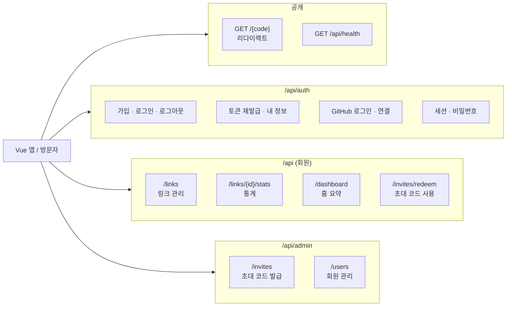
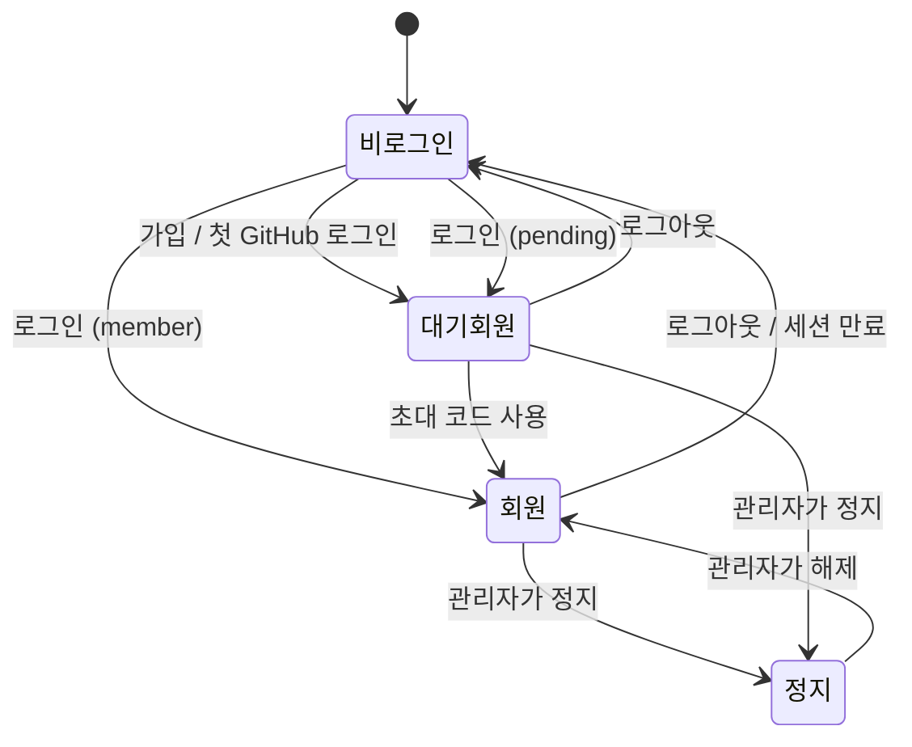
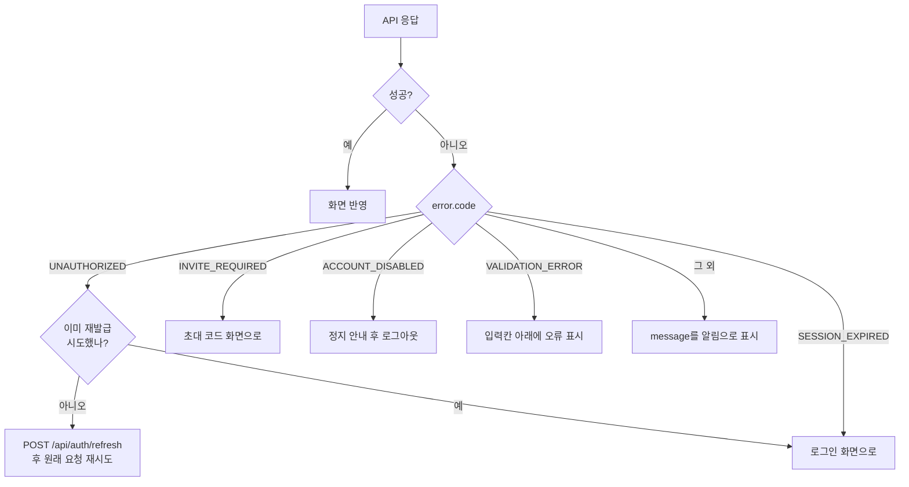
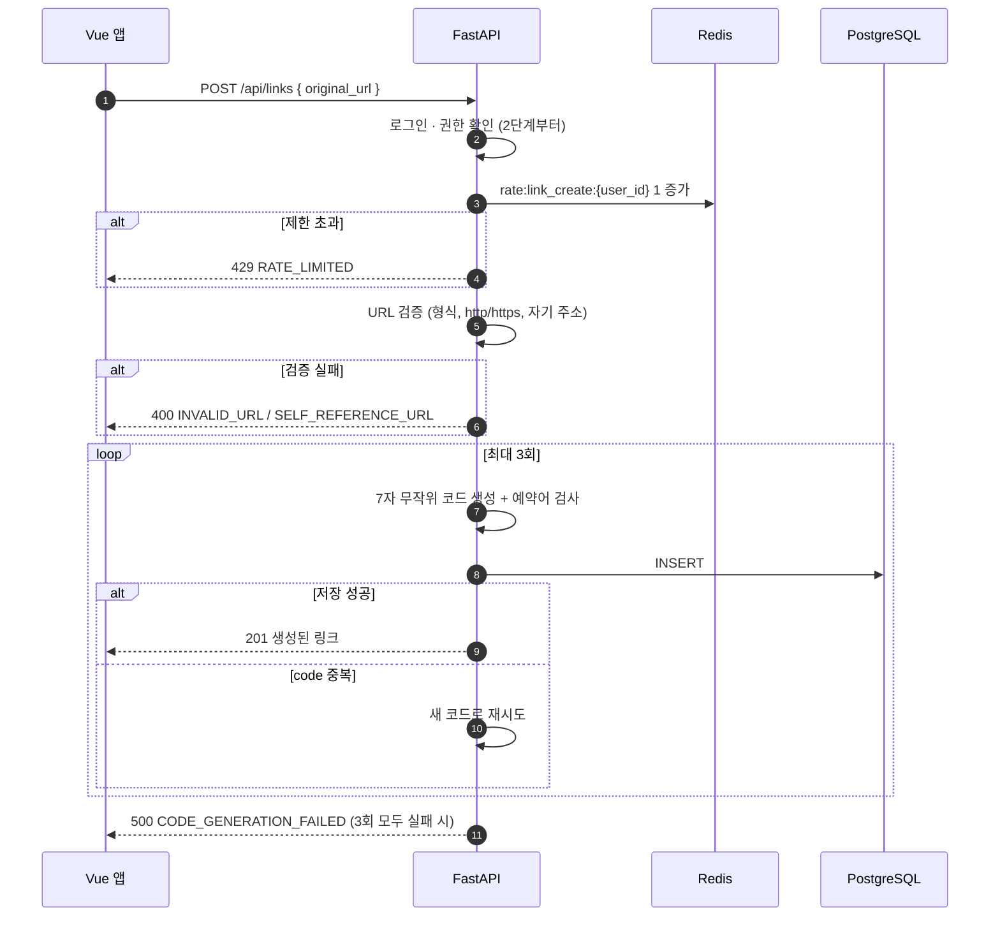
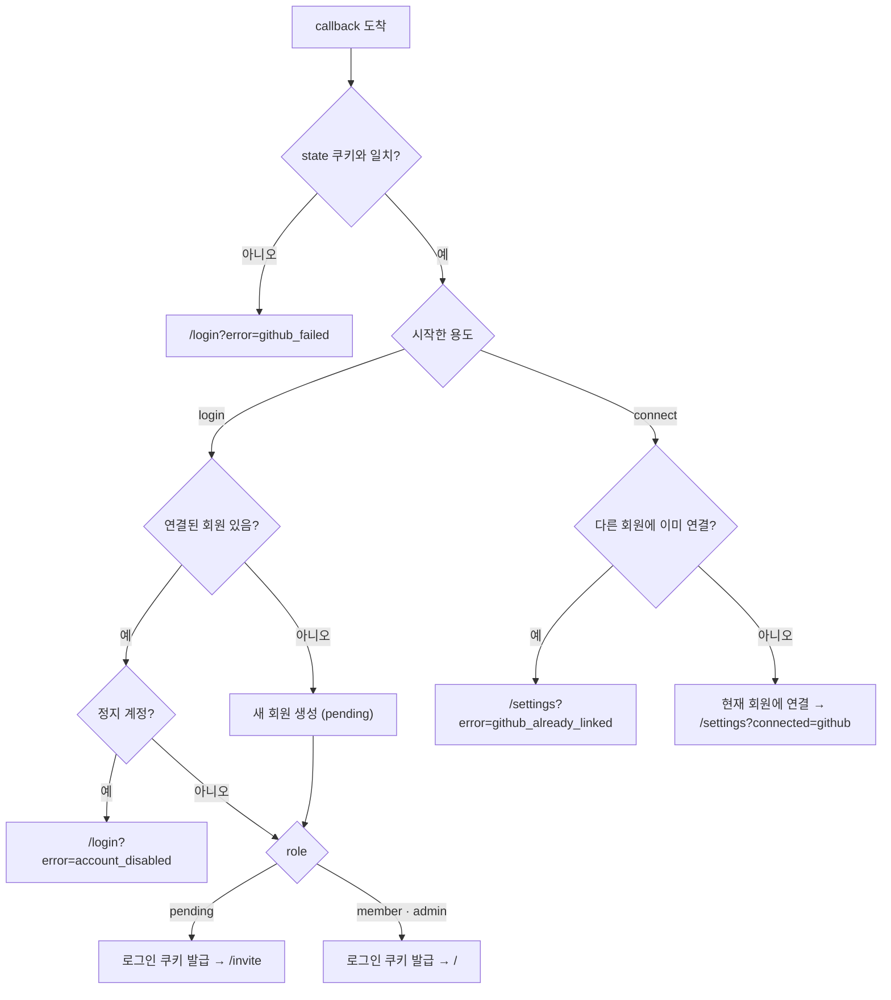
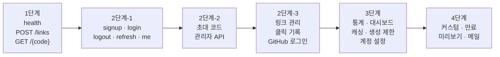

# 콕 (kkok) API 명세서

> 버전: v0.1
> 작성일: 2026-09-17
> 관련 문서: `01_requirements.md`, `02_architecture.md`, `03_erd.md`

---

## 1. 개요

API 명세서는 프론트엔드와 백엔드가 **"이 모양대로 주고받자"고 약속하는 계약서**다.
화면을 만들 때도, 백엔드를 만들 때도 이 문서를 기준으로 삼는다.

### 1.1 기본 규칙

| 항목 | 규칙 |
|---|---|
| 기본 경로 | `/api` (리다이렉트 `/{code}`와 상태 확인만 예외) |
| 데이터 형식 | 요청 · 응답 모두 JSON (`Content-Type: application/json`) |
| 필드 이름 | `snake_case` (Pydantic 기본값을 그대로 사용해 변환 코드를 줄임) |
| 시간 형식 | ISO 8601, UTC (예: `2026-09-17T03:00:00Z`). 화면에서 한국 시간으로 변환 |
| 통계 집계 기준 | 일별 · 시간대별 묶음은 **한국 시간(Asia/Seoul)** 기준 |
| 인증 | httpOnly 쿠키 자동 첨부 (`access_token`, `refresh_token`) |
| 자동 문서 | FastAPI가 `/docs`(Swagger UI)에 자동 생성. 이 문서와 어긋나면 이 문서를 먼저 고친다 |

### 1.2 권한 표기

| 표기 | 의미 |
|---|---|
| 🌐 공개 | 로그인 불필요 |
| 🔑 로그인 | 로그인만 되어 있으면 가능 (`pending` 포함) |
| ✅ 회원 | `member` 이상 |
| 👑 관리자 | `admin`만 |

---

## 2. API 전체 구성



### 2.1 엔드포인트 목록

| # | 메서드 | 경로 | 권한 | 단계 | 요구사항 |
|:-:|---|---|:-:|:-:|---|
| 1 | GET | `/{code}` | 🌐 | 1 | F-02, F-12, F-15 |
| 2 | GET | `/api/health` | 🌐 | 1 | N-07 |
| 3 | POST | `/api/links` | 🌐 → ✅ | 1 → 2 | F-01, F-03, F-16 |
| 4 | GET | `/api/links` | ✅ | 2 | F-11 |
| 5 | GET | `/api/links/{id}` | ✅ | 2 | F-11 |
| 6 | PATCH | `/api/links/{id}` | ✅ | 2 | F-11 |
| 7 | DELETE | `/api/links/{id}` | ✅ | 2 | F-11 |
| 8 | POST | `/api/auth/signup` | 🌐 | 2 | F-04 |
| 9 | POST | `/api/auth/login` | 🌐 | 2 | F-04, F-06 |
| 10 | POST | `/api/auth/logout` | 🔑 | 2 | N-09 |
| 11 | POST | `/api/auth/refresh` | 🌐 (Refresh 쿠키) | 2 | N-09 |
| 12 | GET | `/api/auth/me` | 🔑 | 2 | F-07 |
| 13 | GET | `/api/auth/github/login` | 🌐 | 2 | F-05 |
| 14 | GET | `/api/auth/github/callback` | 🌐 | 2 | F-05, F-17 |
| 15 | POST | `/api/invites/redeem` | 🔑 (`pending`) | 2 | F-08, F-10 |
| 16 | POST | `/api/admin/invites` | 👑 | 2 | F-09 |
| 17 | GET | `/api/admin/invites` | 👑 | 2 | F-09 |
| 18 | GET | `/api/admin/users` | 👑 | 2 | F-13 |
| 19 | PATCH | `/api/admin/users/{id}` | 👑 | 2 | F-07 |
| 20 | POST | `/api/admin/users/{id}/reset-password` | 👑 | 2 | F-13 |
| 21 | GET | `/api/links/{id}/stats/summary` | ✅ | 3 | F-14 |
| 22 | GET | `/api/links/{id}/stats/timeseries` | ✅ | 3 | F-14 |
| 23 | GET | `/api/links/{id}/stats/breakdown` | ✅ | 3 | F-14 |
| 24 | GET | `/api/links/{id}/stats/heatmap` | ✅ | 3 (선택) | F-14 |
| 25 | GET | `/api/dashboard/summary` | ✅ | 3 | 홈 대시보드 |
| 26 | GET | `/api/auth/github/connect` | 🔑 | 3 | F-17 |
| 27 | DELETE | `/api/auth/github` | 🔑 | 3 | F-17 |
| 28 | PATCH | `/api/auth/password` | 🔑 | 3 | 계정 설정 |
| 29 | GET | `/api/auth/sessions` | 🔑 | 3 (선택) | N-09 |
| 30 | DELETE | `/api/auth/sessions/{id}` | 🔑 | 3 (선택) | N-09 |
| 31 | POST | `/api/auth/email-verification/request` | 🔑 | 4 | F-21 |
| 32 | POST | `/api/auth/email-verification/confirm` | 🌐 | 4 | F-21 |
| 33 | POST | `/api/auth/password-reset/request` | 🌐 | 4 | F-22 |
| 34 | POST | `/api/auth/password-reset/confirm` | 🌐 | 4 | F-22 |
| 35 | POST | `/api/links/{id}/preview/refresh` | ✅ | 4 | F-20 |

> 3번 `POST /api/links`는 1단계에서는 로그인 없이 열어두고, 2단계에서 회원 전용으로 바꾼다.

---

## 3. 공통 규칙

### 3.1 에러 응답 형식 (N-05)

모든 에러는 같은 모양으로 응답한다.

```json
{
  "error": {
    "code": "INVALID_URL",
    "message": "http 또는 https 주소만 줄일 수 있어요.",
    "details": null
  }
}
```

| 필드 | 설명 |
|---|---|
| `code` | 프로그램이 판단하는 값. **프론트는 이 값으로 분기**한다 |
| `message` | 사람에게 보여줄 문장. 그대로 화면에 띄워도 되는 수준 |
| `details` | 추가 정보. 입력 검증 실패 시 필드별 오류 목록 |

입력 검증 실패 예시 (422):

```json
{
  "error": {
    "code": "VALIDATION_ERROR",
    "message": "입력값을 확인해 주세요.",
    "details": [
      { "field": "password", "reason": "8자 이상이어야 해요." }
    ]
  }
}
```

> FastAPI의 기본 422 응답은 모양이 다르다. **예외 처리기(exception handler)를 등록해서** 위 형식으로 통일한다.

### 3.2 상태 코드

| 코드 | 의미 | 사용 예 |
|:-:|---|---|
| 200 | 성공 | 조회, 수정 |
| 201 | 생성됨 | 링크 생성, 회원가입 |
| 204 | 성공, 응답 본문 없음 | 삭제, 로그아웃 |
| 302 | 임시 이동 | 리다이렉트, GitHub 로그인 |
| 400 | 잘못된 요청 | 규칙 위반 (예: 자기 서비스 주소 단축) |
| 401 | 인증 필요 | 로그인 안 됨, 토큰 만료 |
| 403 | 권한 없음 | `pending` 회원이 링크 생성 시도 |
| 404 | 없음 | 없는 링크, **남의 링크** |
| 409 | 충돌 | 이미 가입된 이메일, 이미 연결된 GitHub |
| 422 | 입력 형식 오류 | 필수 값 누락, 길이 초과 |
| 429 | 요청 과다 | 로그인 잠금, 생성 횟수 초과 |
| 500 | 서버 오류 | 예상하지 못한 오류 |

**남의 링크에 403이 아니라 404를 주는 이유**
403은 "그 링크가 존재하긴 한다"는 사실을 알려준다. 404로 응답하면 남의 링크가 있는지조차 알 수 없다.

### 3.3 에러 코드 목록

| 코드 | 상태 | 상황 |
|---|:-:|---|
| `VALIDATION_ERROR` | 422 | 입력 형식 오류 |
| `UNAUTHORIZED` | 401 | 로그인 필요 / Access Token 만료 |
| `SESSION_EXPIRED` | 401 | Refresh Token 만료 · 로그아웃됨 → 재로그인 필요 |
| `FORBIDDEN` | 403 | 권한 부족 |
| `INVITE_REQUIRED` | 403 | `pending` 회원이 회원 기능 사용 시도 |
| `ACCOUNT_DISABLED` | 403 | 정지된 계정 |
| `INVALID_CREDENTIALS` | 401 | 이메일 또는 비밀번호 틀림 (어느 쪽인지 알려주지 않음) |
| `LOGIN_LOCKED` | 429 | 로그인 실패 횟수 초과 |
| `EMAIL_TAKEN` | 409 | 이미 가입된 이메일 |
| `GITHUB_ALREADY_LINKED` | 409 | 이 GitHub 계정이 다른 회원에 연결됨 |
| `LAST_LOGIN_METHOD` | 400 | 남은 로그인 수단이 없어져서 해제 불가 |
| `INVALID_INVITE_CODE` | 400 | 없음 · 사용됨 · 만료된 초대 코드 (구분하지 않음) |
| `ALREADY_MEMBER` | 400 | 이미 회원인데 초대 코드 입력 |
| `INVALID_URL` | 400 | http/https가 아니거나 형식 오류 |
| `SELF_REFERENCE_URL` | 400 | 콕 자신의 주소를 줄이려 함 |
| `RATE_LIMITED` | 429 | 링크 생성 횟수 초과 |
| `LINK_NOT_FOUND` | 404 | 없거나 남의 링크 |
| `CODE_GENERATION_FAILED` | 500 | 재시도 후에도 코드 생성 실패 |
| `RESERVED_CODE` | 400 | (4단계) 예약어 커스텀 코드 |
| `CODE_TAKEN` | 409 | (4단계) 이미 사용 중인 커스텀 코드 |
| `INVALID_TOKEN` | 400 | (4단계) 이메일 인증 · 재설정 토큰 오류 |

429 응답에는 `Retry-After` 헤더(초 단위)를 함께 보낸다.

### 3.4 목록 조회 (페이지)

요청: `?page=1&size=20` (size 최대 100)

응답:

```json
{
  "items": [],
  "total": 42,
  "page": 1,
  "size": 20
}
```

### 3.5 인증 상태 흐름



### 3.6 프론트엔드 공통 에러 처리



- 이 처리는 화면마다 따로 쓰지 않고 `frontend/src/api/`의 **공통 요청 함수 한 곳**에 넣는다.
- 여러 요청이 동시에 401을 받으면 재발급 요청은 **하나만** 보내고 나머지는 그 결과를 기다린다.

---

## 4. 리다이렉트 · 상태 확인

### 4.1 `GET /{code}` — 짧은 링크 이동

🌐 공개 · 1단계

| 상황 | 응답 |
|---|---|
| 이동 가능 | `302` + `Location: 원래 주소` |
| 없는 코드 · 삭제됨 | `302` + `Location: /notice/not-found` |
| 비활성화됨 | `302` + `Location: /notice/inactive` |
| 만료됨 (4단계) | `302` + `Location: /notice/expired` |

**응답 헤더**

```
Cache-Control: no-store
```

- 브라우저가 이동 결과를 기억하면 다음 클릭이 서버를 거치지 않아 **클릭 수가 빠진다.** 302에 더해 캐시 금지 헤더를 붙인다.
- 안내 페이지는 Vue 화면이다. `/notice/...`는 두 단계 경로라 Nginx 규칙상 Vue로 가고, `notice`는 **예약어**에 추가한다.
- 안내 페이지로 보낼 때 상태 코드가 404가 아니라 302가 되는 건 알고 쓰는 단순화다.

처리 순서는 `kkok-architecture.md` 4.1 참고.

### 4.2 `GET /api/health` — 서버 상태 확인

🌐 공개 · 1단계

```json
{ "status": "ok", "database": "ok", "redis": "ok" }
```

- Docker Compose · 배포 환경에서 "서버가 살아 있는지" 확인하는 데 쓴다.
- DB나 Redis 연결이 안 되면 `503`과 함께 해당 항목을 `"error"`로 표시한다.

---

## 5. 링크 API

### 5.1 링크 생성 흐름



### 5.2 `POST /api/links` — 링크 생성

✅ 회원 (1단계는 🌐) · 1단계

요청

```json
{
  "original_url": "https://github.com/minkyu/kkok"
}
```

| 필드 | 타입 | 필수 | 규칙 |
|---|---|:-:|---|
| `original_url` | string | O | 최대 2048자, http/https, 콕 자신의 도메인 금지 |
| `custom_code` | string | X | **4단계.** `a-z 0-9 -`, 3~32자, 소문자로 저장 |
| `expires_at` | string (시각) | X | **4단계.** 현재보다 미래 |

응답 `201`

```json
{
  "id": 12,
  "code": "aB3xK9q",
  "short_url": "https://kkok.example/aB3xK9q",
  "original_url": "https://github.com/minkyu/kkok",
  "is_active": true,
  "is_custom": false,
  "expires_at": null,
  "title": null,
  "click_count": 0,
  "created_at": "2026-09-17T03:00:00Z"
}
```

- `short_url`은 서버 설정의 기본 주소와 `code`를 합쳐서 만든다. 프론트가 직접 조립하지 않게 해서 주소 규칙이 한 곳에만 있게 한다.
- 이 응답 모양을 **링크 기본 응답(`LinkResponse`)**이라 부르고, 아래 API에서 재사용한다.

에러: `VALIDATION_ERROR`, `INVALID_URL`, `SELF_REFERENCE_URL`, `RATE_LIMITED`, `INVITE_REQUIRED`, `CODE_GENERATION_FAILED`, (4단계) `RESERVED_CODE`, `CODE_TAKEN`

### 5.3 `GET /api/links` — 내 링크 목록

✅ 회원 · 2단계

| 쿼리 | 기본값 | 설명 |
|---|---|---|
| `page` | 1 | 페이지 번호 |
| `size` | 20 | 최대 100 |
| `q` | - | 원래 주소 · 코드 · 제목 검색 |
| `status` | `all` | `all` / `active` / `inactive` |
| `sort` | `created_desc` | `created_desc` / `created_asc` / `clicks_desc` |

응답 `200`: `items`에 `LinkResponse` 목록 (3.4 형식)

- 삭제된 링크는 항상 제외한다.
- `click_count`는 **봇 제외** 전체 클릭 수다.

### 5.4 `GET /api/links/{id}` — 링크 한 개 조회

✅ 회원 · 2단계

응답 `200`: `LinkResponse`
에러: `LINK_NOT_FOUND` (없음 · 삭제됨 · 남의 링크)

### 5.5 `PATCH /api/links/{id}` — 링크 수정

✅ 회원 · 2단계

요청 (보낸 필드만 수정)

```json
{
  "is_active": false
}
```

| 필드 | 단계 | 설명 |
|---|:-:|---|
| `is_active` | 2 | 활성 / 비활성 전환 |
| `expires_at` | 4 | 만료일 변경, `null`이면 만료 없음 |

- `code`와 `original_url`은 **수정할 수 없다.** 이미 퍼진 링크가 다른 곳으로 가게 되는 혼란을 막기 위해서다. 주소를 바꾸고 싶으면 새 링크를 만든다.
- 수정 후 Redis 캐시 `link:{code}`를 삭제한다.

응답 `200`: 수정된 `LinkResponse`

### 5.6 `DELETE /api/links/{id}` — 링크 삭제

✅ 회원 · 2단계

응답 `204`

- 소프트 삭제 (`deleted_at` 기록). 코드는 재사용되지 않는다.
- Redis 캐시 `link:{code}` 삭제.

### 5.7 `POST /api/links/{id}/preview/refresh` — 미리보기 다시 수집

✅ 회원 · 4단계

응답 `202` (접수됨, 수집은 백그라운드에서 진행)

- 링크 생성 시에도 백그라운드로 한 번 수집한다.
- 원본 페이지 접속에는 **시간 제한(예: 5초)과 응답 크기 제한**을 둔다. 내부망 주소(`localhost`, 사설 IP)로는 요청하지 않는다. (서버가 내부 시스템을 대신 찔러보게 만드는 공격 방지)

---

## 6. 통계 API

통계 API는 공통으로 아래 쿼리를 받는다.

| 쿼리 | 기본값 | 설명 |
|---|---|---|
| `from` | 30일 전 | 시작 날짜 (`YYYY-MM-DD`, 한국 날짜) |
| `to` | 오늘 | 종료 날짜 (포함) |
| `include_bots` | `false` | 봇 클릭 포함 여부 |

- 기간은 **최대 366일**로 제한한다.
- 차트마다 API를 나눈 이유: 화면에서 **차트별로 따로 불러오고 따로 로딩 표시**를 할 수 있고, 필터를 바꿀 때 필요한 차트만 다시 불러올 수 있다.

### 6.1 `GET /api/links/{id}/stats/summary` — 요약 숫자

✅ 회원 · 3단계

```json
{
  "total_clicks": 1284,
  "period_clicks": 312,
  "today_clicks": 17,
  "last_clicked_at": "2026-09-17T02:41:00Z"
}
```

### 6.2 `GET /api/links/{id}/stats/timeseries` — 기간별 클릭 추이

✅ 회원 · 3단계

추가 쿼리: `interval` = `day`(기본) / `hour` (`hour`는 최대 7일)

```json
{
  "interval": "day",
  "points": [
    { "bucket": "2026-09-15", "clicks": 40 },
    { "bucket": "2026-09-16", "clicks": 0 },
    { "bucket": "2026-09-17", "clicks": 17 }
  ]
}
```

- 클릭이 0인 날짜도 **빠짐없이** 채워서 보낸다. 빠진 날이 있으면 선 차트가 끊기거나 잘못 이어진다.

### 6.3 `GET /api/links/{id}/stats/breakdown` — 항목별 비율

✅ 회원 · 3단계

추가 쿼리: `by` = `device` / `browser` / `os` / `referrer` (필수), `limit` = 기본 10

```json
{
  "by": "referrer",
  "items": [
    { "label": "github.com", "clicks": 120 },
    { "label": "(직접 방문)", "clicks": 80 },
    { "label": "기타", "clicks": 12 }
  ]
}
```

- `limit`을 넘는 항목은 `"기타"`로 합친다.
- 유입 경로가 없으면 `"(직접 방문)"`으로 표시한다.

### 6.4 `GET /api/links/{id}/stats/heatmap` — 요일 × 시간대

✅ 회원 · 3단계 (선택)

```json
{
  "cells": [
    { "weekday": 0, "hour": 9, "clicks": 5 }
  ]
}
```

- `weekday`: 0 = 월요일 ~ 6 = 일요일
- 전체 7 × 24 = 168칸을 0 포함해 모두 보낸다.

### 6.5 `GET /api/dashboard/summary` — 홈 대시보드

✅ 회원 · 3단계

```json
{
  "link_count": 23,
  "total_clicks": 5120,
  "clicks_last_7_days": 431,
  "top_links": [
    { "id": 12, "code": "aB3xK9q", "title": null, "original_url": "https://...", "clicks": 210 }
  ]
}
```

- `top_links`: 최근 7일 클릭 기준 상위 5개

---

## 7. 인증 API

### 7.1 `POST /api/auth/signup` — 회원가입

🌐 공개 · 2단계

요청

```json
{
  "email": "minkyu@example.com",
  "password": "********",
  "display_name": "민규"
}
```

| 필드 | 규칙 |
|---|---|
| `email` | 이메일 형식, 소문자로 정규화 |
| `password` | 8~128자 |
| `display_name` | 1~50자 |

응답 `201`: `MeResponse` (7.5) + 로그인 쿠키 발급 (가입 즉시 로그인, `role = pending`)
에러: `VALIDATION_ERROR`, `EMAIL_TAKEN`

> `EMAIL_TAKEN`은 "이 이메일이 가입돼 있다"는 사실을 알려주는 단점이 있다. 초대제 서비스라 사용자 경험을 우선해서 허용한다.

### 7.2 `POST /api/auth/login` — 로그인

🌐 공개 · 2단계

요청

```json
{
  "email": "minkyu@example.com",
  "password": "********"
}
```

응답 `200`: `MeResponse` + 쿠키 발급

```
Set-Cookie: access_token=...; HttpOnly; Secure; SameSite=Strict; Path=/; Max-Age=900
Set-Cookie: refresh_token=...; HttpOnly; Secure; SameSite=Strict; Path=/api/auth; Max-Age=1209600
```

에러: `INVALID_CREDENTIALS`, `LOGIN_LOCKED`, `ACCOUNT_DISABLED`

- 이메일이 없어도, 비밀번호가 틀려도, GitHub 전용 계정이어도 **똑같이** `INVALID_CREDENTIALS`로 응답한다.
- 실패 시 Redis `login_fail:{email}` 증가, 성공 시 삭제.

### 7.3 `POST /api/auth/logout` — 로그아웃

🔑 로그인 · 2단계

응답 `204` + 두 쿠키 삭제, 현재 세션 `revoked_at` 기록

### 7.4 `POST /api/auth/refresh` — Access Token 재발급

🌐 (Refresh 쿠키 필요) · 2단계

응답 `204` + 새 `access_token` 쿠키
에러: `SESSION_EXPIRED`, `ACCOUNT_DISABLED`

### 7.5 `GET /api/auth/me` — 내 정보

🔑 로그인 · 2단계

```json
{
  "id": 3,
  "email": "minkyu@example.com",
  "display_name": "민규",
  "role": "member",
  "has_password": true,
  "github": { "username": "minkyu" },
  "created_at": "2026-09-17T03:00:00Z"
}
```

- 이 모양을 **`MeResponse`**라 부른다.
- `github`: 연결 안 됐으면 `null`
- `has_password`: 비밀번호 해시 자체는 절대 보내지 않고, **있는지 여부만** 알려준다. 계정 설정 화면에서 "비밀번호 변경" 버튼을 보여줄지 판단하는 데 쓴다.
- Vue 앱은 처음 켜질 때 이 API를 불러 로그인 상태를 Pinia에 채운다. `401`이면 비로그인 상태로 시작한다.

### 7.6 GitHub 로그인 · 연결

| API | 권한 | 단계 | 용도 |
|---|:-:|:-:|---|
| `GET /api/auth/github/login` | 🌐 | 2 | GitHub로 로그인 / 가입 시작 |
| `GET /api/auth/github/connect` | 🔑 | 3 | 로그인한 상태에서 GitHub 연결 시작 |
| `GET /api/auth/github/callback` | 🌐 | 2 | GitHub에서 돌아오는 곳 (두 용도 공통) |
| `DELETE /api/auth/github` | 🔑 | 3 | GitHub 연결 해제 |



- `login` / `connect` 시작 API는 JSON이 아니라 **`302`로 GitHub 인증 페이지로 이동**시킨다. 프론트는 `fetch`가 아니라 **페이지 이동**(`window.location.href`)으로 호출한다.
- 시작할 때 `state` 값과 용도(`login` / `connect`)를 `oauth_state` 쿠키에 담는다.
- callback은 JSON 대신 **Vue 화면 주소로 302 이동**하며, 결과는 쿼리 문자열로 알려준다.

`DELETE /api/auth/github`
응답 `204` / 에러: `LAST_LOGIN_METHOD` (비밀번호가 없는 회원은 해제 불가)

### 7.7 `PATCH /api/auth/password` — 비밀번호 변경 · 설정

🔑 로그인 · 3단계

```json
{
  "current_password": "********",
  "new_password": "********"
}
```

- 비밀번호가 없는 GitHub 전용 회원은 `current_password` 없이 **새로 설정**할 수 있다. 이때 로그인용 이메일(`email`)도 함께 받는다.
- 변경 성공 시 **현재 세션을 제외한 모든 세션**을 로그아웃 처리한다.

응답 `204` / 에러: `INVALID_CREDENTIALS`, `VALIDATION_ERROR`, `EMAIL_TAKEN`

### 7.8 로그인 기기 관리 (3단계 선택)

`GET /api/auth/sessions`

```json
{
  "items": [
    {
      "id": 41,
      "device_label": "Chrome · Windows",
      "created_at": "2026-09-10T11:00:00Z",
      "last_used_at": "2026-09-17T02:00:00Z",
      "is_current": true
    }
  ]
}
```

`DELETE /api/auth/sessions/{id}` → `204` (해당 기기 로그아웃)

### 7.9 이메일 인증 · 비밀번호 재설정 (4단계)

| API | 요청 | 응답 |
|---|---|---|
| `POST /email-verification/request` | 없음 | `202` 메일 발송 |
| `POST /email-verification/confirm` | `{ "token": "..." }` | `204` / `INVALID_TOKEN` |
| `POST /password-reset/request` | `{ "email": "..." }` | **항상** `202` |
| `POST /password-reset/confirm` | `{ "token": "...", "new_password": "..." }` | `204` / `INVALID_TOKEN` |

- 재설정 요청은 가입되지 않은 이메일이어도 똑같이 `202`로 응답한다. (가입 여부 노출 방지)
- 재설정 완료 시 해당 회원의 **모든 세션**을 로그아웃 처리한다.

---

## 8. 초대 코드 API

### 8.1 `POST /api/invites/redeem` — 초대 코드 사용

🔑 로그인 (`pending`) · 2단계

요청

```json
{ "code": "k7p2 xq9m" }
```

- 대문자로 바꾸고 공백 · `-`를 정리한 뒤 비교한다. (`K7P2XQ9M`)

응답 `200`: 승격된 `MeResponse` (`role: "member"`)
에러: `INVALID_INVITE_CODE`, `ALREADY_MEMBER`

- 없음 · 사용됨 · 만료를 **구분하지 않고** 같은 에러로 응답한다. 코드를 무작위로 찔러보는 사람에게 힌트를 주지 않기 위해서다.
- 같은 사용자의 연속 실패는 로그인과 같은 방식으로 Redis에서 제한한다. (`invite_fail:{user_id}`)

### 8.2 `POST /api/admin/invites` — 초대 코드 발급

👑 관리자 · 2단계

요청

```json
{
  "memo": "대학 동기 지훈",
  "expires_in_days": 7
}
```

| 필드 | 규칙 |
|---|---|
| `memo` | 선택, 최대 100자 |
| `expires_in_days` | 1~30, 기본 7 |

응답 `201`

```json
{
  "id": 5,
  "code": "K7P2-XQ9M",
  "memo": "대학 동기 지훈",
  "expires_at": "2026-09-24T03:00:00Z",
  "status": "unused",
  "used_by": null,
  "used_at": null,
  "created_at": "2026-09-17T03:00:00Z"
}
```

### 8.3 `GET /api/admin/invites` — 초대 코드 목록

👑 관리자 · 2단계

쿼리: `page`, `size`, `status` = `all` / `unused` / `used` / `expired`

응답: `items`에 8.2 응답 모양 목록

- `status`는 DB 컬럼이 아니라 `used_by` · `expires_at`으로 **계산한 값**이다.
- `used_by`는 `{ "id": 7, "display_name": "지훈" }` 모양으로 보낸다.

---

## 9. 관리자 회원 API

### 9.1 `GET /api/admin/users` — 회원 목록

👑 관리자 · 2단계

쿼리: `page`, `size`, `q`(이메일 · 이름 검색), `role`, `is_active`

```json
{
  "items": [
    {
      "id": 7,
      "email": "jihoon@example.com",
      "display_name": "지훈",
      "role": "member",
      "is_active": true,
      "login_methods": ["password", "github"],
      "link_count": 4,
      "last_login_at": "2026-09-16T12:00:00Z",
      "created_at": "2026-09-10T03:00:00Z"
    }
  ],
  "total": 1,
  "page": 1,
  "size": 20
}
```

### 9.2 `PATCH /api/admin/users/{id}` — 회원 상태 변경

👑 관리자 · 2단계

```json
{
  "is_active": false,
  "role": "member"
}
```

- `is_active: false`로 바꾸면 해당 회원의 **모든 세션을 로그아웃** 처리한다.
- 관리자 **자기 자신**의 정지 · 권한 변경은 거부한다. (관리자가 한 명도 없어지는 사고 방지)
- `role`을 `admin`으로 바꾸는 것은 허용하지 않는다. 관리자는 서버 설정으로만 지정한다.

### 9.3 `POST /api/admin/users/{id}/reset-password` — 임시 비밀번호 발급

👑 관리자 · 2단계 (메일 기능 전까지 사용)

응답 `200`

```json
{ "temporary_password": "q8Zt-4mWp-Xr2K" }
```

- 임시 비밀번호는 **이 응답에서 딱 한 번만** 보여주고 어디에도 원문을 저장하지 않는다.
- 해당 회원의 모든 세션을 로그아웃 처리한다.
- 관리자가 직접 전달하고, 회원은 로그인 후 7.7로 변경한다.

---

## 10. 백엔드 파일 배치

| 라우터 파일 (`app/api/`) | 담당 경로 | 스키마 파일 (`app/schemas/`) |
|---|---|---|
| `redirect.py` | `/{code}` | - |
| `health.py` | `/api/health` | `health.py` |
| `links.py` | `/api/links` | `link.py` |
| `stats.py` | `/api/links/{id}/stats`, `/api/dashboard` | `stats.py` |
| `auth.py` | `/api/auth` | `auth.py`, `user.py` |
| `github_oauth.py` | `/api/auth/github` | - |
| `invites.py` | `/api/invites` | `invite.py` |
| `admin.py` | `/api/admin` | `admin.py` |

> `redirect.py`의 `/{code}` 라우트는 **가장 마지막에 등록**한다. 먼저 등록하면 다른 경로를 전부 가로챌 수 있다.

주요 스키마 이름

| 스키마 | 용도 |
|---|---|
| `LinkCreate`, `LinkUpdate`, `LinkResponse` | 링크 생성 · 수정 · 응답 |
| `SignupRequest`, `LoginRequest`, `MeResponse` | 인증 |
| `InviteRedeemRequest`, `InviteCreate`, `InviteResponse` | 초대 코드 |
| `Page[T]` | 목록 응답 공통 (`items`, `total`, `page`, `size`) |
| `ErrorResponse` | 에러 응답 공통 |

---

## 11. 단계별 구현 순서



- GitHub 로그인은 자체 로그인과 쿠키 · 세션 흐름이 **완전히 동작한 뒤**에 붙인다. 두 개를 동시에 만들면 문제가 생겼을 때 어느 쪽 원인인지 찾기 어렵다.
- 각 단계가 끝날 때마다 Swagger UI(`/docs`)에서 직접 호출해보고, 핵심 흐름은 pytest로 남긴다.

---

## 12. 결정 기록

| 항목 | 결정 | 이유 |
|---|---|---|
| 필드 이름 | `snake_case` | Pydantic 기본값 그대로 사용, 변환 설정 불필요 |
| 에러 형식 | `{ error: { code, message, details } }` 통일 | 프론트가 `code` 하나로 분기 가능 |
| 남의 리소스 접근 | 403 대신 404 | 존재 여부 노출 방지 |
| 링크 수정 범위 | 활성 여부 · 만료일만 | 이미 퍼진 링크의 목적지가 바뀌는 혼란 방지 |
| 리다이렉트 캐시 | `Cache-Control: no-store` | 브라우저 캐시로 클릭 집계가 빠지는 것 방지 |
| 없는 링크 처리 | Vue 안내 페이지(`/notice/...`)로 302 | 안내 화면을 프론트에서 예쁘게 구성 |
| 통계 API | 차트별로 분리 | 차트별 로딩 · 부분 갱신 |
| 통계 날짜 기준 | 한국 시간 | 사용자가 보는 "오늘"과 일치 |
| 초대 코드 실패 | 이유 구분 없이 한 에러 | 무작위 대입 힌트 차단 |
| 로그인 실패 | 이유 구분 없이 한 에러 | 계정 존재 여부 노출 방지 |
| 관리자 지정 | API로 불가, 서버 설정으로만 | 권한 상승 사고 방지 |

---

## 13. 남은 미정 사항

- [ ] Redis 만료 시간 · 제한 횟수 확정 (로그인 · 링크 생성 · 초대 코드 실패)
- [ ] 차트 라이브러리 최종 선택 (ECharts vs ApexCharts)
- [ ] Refresh Token Rotation 도입 시점
- [ ] 서비스 기본 주소 (배포 도메인)
