# 콕 (kkok) 화면 설계서

> 버전: v0.1
> 작성일: 2026-09-17
> 관련 문서: `01_requirements.md`, `02_architecture.md`, `03_erd.md`, `04_api-spec.md`

---

## 1. 개요

화면 설계서는 **"어떤 화면이 있고, 각 화면에 무엇이 놓이고, 누르면 무슨 일이 일어나는지"**를 정리한 문서다.
API 명세가 프론트와 백엔드의 계약서라면, 화면 설계서는 **가구 배치도**다.

### 1.1 화면 ID 규칙

- `SCR-xx`: 페이지 단위 화면
- `CMP-xx`: 여러 화면에서 재사용하는 부품 (다이얼로그, 헤더 등)
- `UC-xx`: 유즈케이스

### 1.2 디자인 원칙

| 항목 | 원칙 |
|---|---|
| 톤 | 가볍고 경쾌하게. "콕" 누르는 손가락을 모티프로 사용 |
| UI 부품 | shadcn-vue 우선 사용, 필요한 경우만 직접 제작 |
| 스타일 | Tailwind CSS. 색상은 CSS 변수로 정의해 다크모드 대응 |
| 포인트 컬러 | 코랄 오렌지 `#FF6B4A` (라이트) / `#FF8B6B` (다크) |
| 상태 색 | 성공 `#22C55E` · 에러 `#EF4444` · 경고 `#F59E0B` |
| 폰트 | Pretendard (한글 · 영문 · 숫자 혼용 가독성) |
| 다크모드 | 시스템 설정 따라가기 + 헤더에서 직접 전환 (라이트 / 다크 / 시스템) |
| 반응형 | 모바일 우선. `md`(768px) 기준으로 레이아웃 전환 |
| 애니메이션 | Motion 사용. **사용자 행동에 대한 피드백**에만 쓰고, 장식용 반복 애니메이션은 쓰지 않음 |
| 접근성 | 키보드로 모든 기능 사용 가능, 포커스 표시 유지, 색만으로 정보 전달 금지, 시스템의 "동작 줄이기" 설정 시 애니메이션 최소화 |
| 문구 | 반말이 아닌 **부드러운 존댓말** (예: "링크를 만들었어요") |

---

## 2. 유즈케이스

### 2.1 액터

| 액터 | 설명 |
|---|---|
| 방문자 | 짧은 링크를 누르는 사람, 또는 로그인하지 않은 사람 |
| 대기 회원 | 가입했지만 초대 코드를 아직 입력하지 않은 사람 |
| 회원 | 초대 코드로 승격된 사람 |
| 관리자 | 개발자 본인. 회원이 할 수 있는 일을 모두 할 수 있음 |
| GitHub | 외부 인증 시스템 |

> mermaid에는 공식 유즈케이스 다이어그램 문법이 없어서, `flowchart`로 **액터(사각형)와 유즈케이스(타원)** 모양을 흉내 내어 표현한다.
> 점선 화살표는 **상속**(예: 회원은 대기 회원이 할 수 있는 일을 모두 할 수 있음)을 뜻한다.

### 2.2 방문자 · 대기 회원

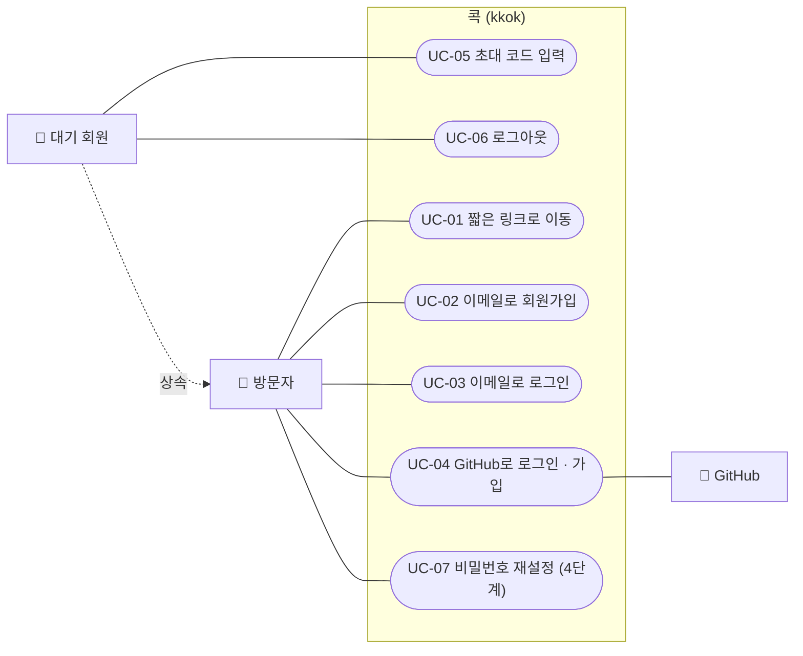

### 2.3 회원

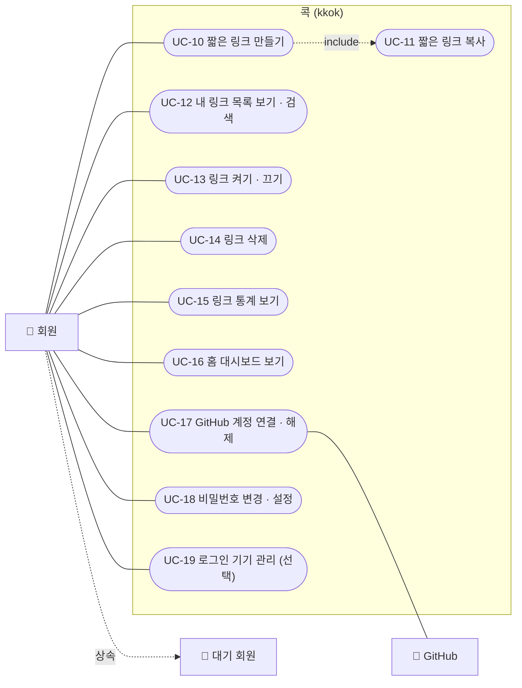

- `include`: UC-10(링크 만들기)을 하면 결과 화면에서 UC-11(복사)이 항상 함께 제공된다는 뜻이다.

### 2.4 관리자

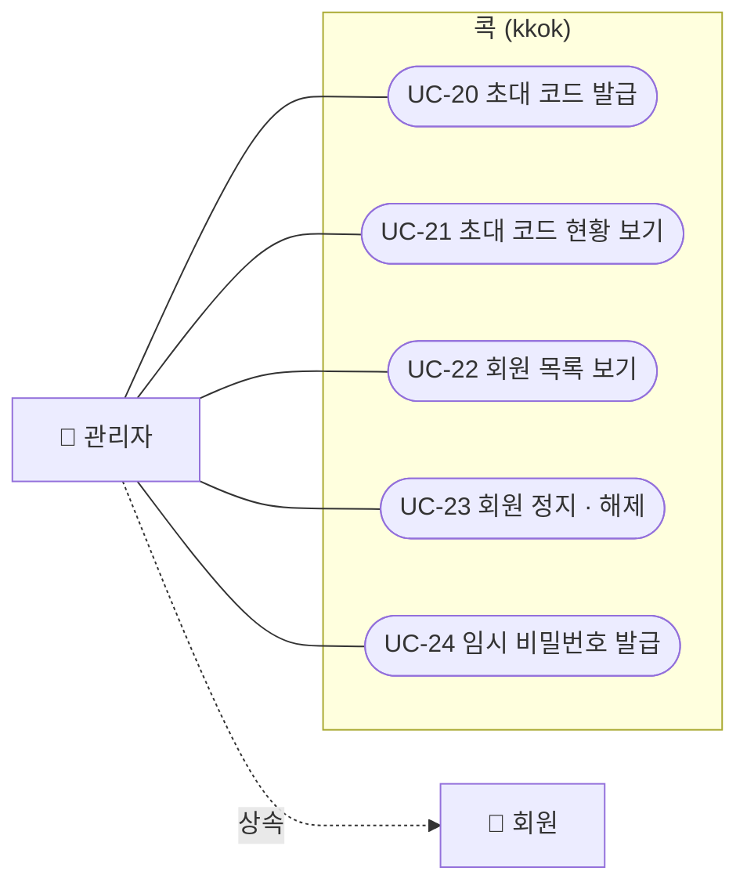

### 2.5 유즈케이스 → 화면 연결

| UC | 이름 | 화면 | 요구사항 | 단계 |
|---|---|---|---|:-:|
| UC-01 | 짧은 링크로 이동 | (백엔드) / SCR-12 | F-02 | 1 |
| UC-02 | 이메일로 회원가입 | SCR-03 | F-04 | 2 |
| UC-03 | 이메일로 로그인 | SCR-02 | F-04, F-06 | 2 |
| UC-04 | GitHub로 로그인 · 가입 | SCR-02, SCR-03 | F-05 | 2 |
| UC-05 | 초대 코드 입력 | SCR-04 | F-08 | 2 |
| UC-06 | 로그아웃 | CMP-01 | N-09 | 2 |
| UC-07 | 비밀번호 재설정 | SCR-13, SCR-14 | F-22 | 4 |
| UC-10 | 짧은 링크 만들기 | CMP-02 (SCR-01, 05, 06) | F-01 | 1 |
| UC-11 | 짧은 링크 복사 | CMP-02, SCR-06, SCR-08 | F-01 | 1 |
| UC-12 | 내 링크 목록 보기 · 검색 | SCR-06 | F-11 | 2 |
| UC-13 | 링크 켜기 · 끄기 | SCR-06, SCR-08 | F-11 | 2 |
| UC-14 | 링크 삭제 | SCR-06, SCR-08 | F-11 | 2 |
| UC-15 | 링크 통계 보기 | SCR-08 | F-14 | 3 |
| UC-16 | 홈 대시보드 보기 | SCR-05 | - | 3 |
| UC-17 | GitHub 계정 연결 · 해제 | SCR-09 | F-17 | 3 |
| UC-18 | 비밀번호 변경 · 설정 | SCR-09 | - | 3 |
| UC-19 | 로그인 기기 관리 | SCR-09 | N-09 | 3 (선택) |
| UC-20 | 초대 코드 발급 | SCR-10 | F-15 | 2 |
| UC-21 | 초대 코드 현황 보기 | SCR-10 | F-15 | 2 |
| UC-22 | 회원 목록 보기 | SCR-11 | F-13 | 2 |
| UC-23 | 회원 정지 · 해제 | SCR-11 | F-07 | 2 |
| UC-24 | 임시 비밀번호 발급 | SCR-11 | F-13 | 2 |

---

## 3. 화면 목록과 라우트

| ID | 화면 | 경로 | 권한 | 레이아웃 | 단계 |
|---|---|---|:-:|---|:-:|
| SCR-01 | 랜딩 | `/` | 비로그인 | 공개 | 1 |
| SCR-02 | 로그인 | `/login` | 비로그인 | 인증 | 2 |
| SCR-03 | 회원가입 | `/signup` | 비로그인 | 인증 | 2 |
| SCR-04 | 초대 코드 입력 | `/invite` | 대기 회원 | 인증 | 2 |
| SCR-05 | 홈 대시보드 | `/` | 회원 | 앱 | 3 (2단계는 SCR-06으로 이동) |
| SCR-06 | 내 링크 목록 | `/links` | 회원 | 앱 | 2 |
| SCR-08 | 링크 상세 · 통계 | `/links/:id` | 회원 | 앱 | 2 (통계는 3) |
| SCR-09 | 계정 설정 | `/settings` | 로그인 | 앱 | 3 |
| SCR-10 | 초대 코드 관리 | `/admin/invites` | 관리자 | 앱 | 2 |
| SCR-11 | 회원 관리 | `/admin/users` | 관리자 | 앱 | 2 |
| SCR-12 | 안내 페이지 | `/notice/:type` | 공개 | 공개 | 1 |
| SCR-13 | 비밀번호 찾기 | `/account/forgot-password` | 비로그인 | 인증 | 4 |
| SCR-14 | 비밀번호 재설정 | `/account/reset-password` | 비로그인 | 인증 | 4 |
| SCR-15 | 이메일 인증 결과 | `/account/verify-email` | 공개 | 인증 | 4 |

| ID | 공통 부품 | 사용 위치 |
|---|---|---|
| CMP-01 | 앱 헤더 (내비게이션 · 사용자 메뉴 · 테마 전환) | 앱 · 공개 레이아웃 |
| CMP-02 | 링크 생성 폼 + 결과 카드 | SCR-01, SCR-05, SCR-06 |
| CMP-03 | 링크 삭제 확인 다이얼로그 | SCR-06, SCR-08 |
| CMP-04 | 빈 상태 / 에러 상태 블록 | 목록 · 차트가 있는 모든 화면 |
| CMP-05 | 기간 필터 | SCR-08 |

**경로 규칙**

- 한 단계 경로(`/login` 등)는 **예약어**여야 한다. 짧은 코드와 겹치기 때문이다.
- 4단계 계정 화면은 `/account/...` 두 단계 경로로 묶어 예약어를 `account` 하나만 추가한다.
- Vue Router에 등록되지 않은 두 단계 이상 경로는 SCR-12의 "페이지를 찾을 수 없어요" 안내로 보낸다.

### 3.1 레이아웃 종류

| 레이아웃 | 구성 | 사용 화면 |
|---|---|---|
| 공개 | 헤더(로고, 로그인 버튼) + 본문 + 푸터 | SCR-01, SCR-12 |
| 인증 | 가운데 카드 하나. 헤더 없이 로고만 | SCR-02, 03, 04, 13, 14, 15 |
| 앱 | CMP-01 헤더 + 본문(최대 폭 제한) | SCR-05, 06, 08, 09, 10, 11 |

---

## 4. 화면 흐름도

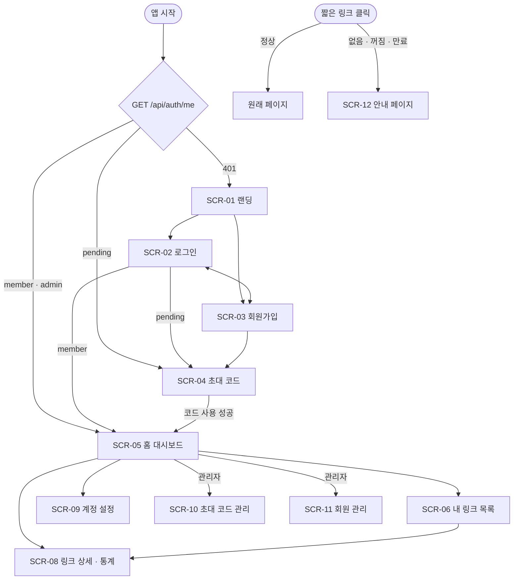

### 4.1 라우터 가드 규칙

| 현재 상태 | 가려는 곳 | 결과 |
|---|---|---|
| 비로그인 | 로그인 필요 화면 | `/login?redirect=원래경로` |
| 로그인 (모든 등급) | `/login`, `/signup` | `/`로 이동 |
| 대기 회원 | 회원 전용 화면 | `/invite` |
| 회원 · 관리자 | `/invite` | `/`로 이동 |
| 회원 | `/admin/*` | `/` + "접근 권한이 없어요" 알림 |

- 로그인 성공 후 `redirect` 값이 있으면 그 경로로 돌아간다. 단, **`/`로 시작하는 내부 경로만** 허용한다. (외부 사이트로 튕겨내는 공격 방지)
- 가드는 편의 기능이다. 실제 권한 검사는 백엔드가 한다.

---

## 5. 앱 시작과 로그인 상태

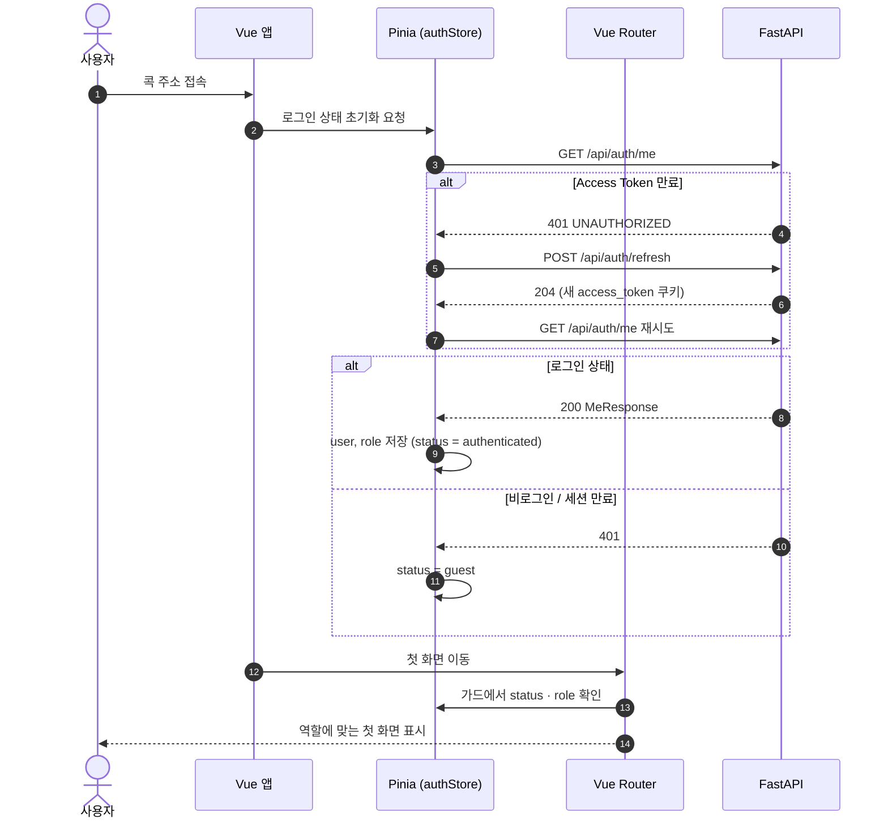

- 로그인 상태를 확인하는 동안에는 **전체 화면 로딩 표시**를 보여준다. 확인 전에 화면을 그리면 비로그인 화면이 잠깐 보였다가 바뀌는 깜빡임이 생긴다.

### 5.1 Pinia 스토어

| 스토어 | 담는 것 | 비고 |
|---|---|---|
| `authStore` | `user`(MeResponse), `status`(`loading` / `guest` / `authenticated`) | 로그인 · 로그아웃 · 승격 시 갱신 |
| `linksStore` | 내 링크 목록, 현재 검색 · 필터 · 페이지 조건 | 생성 · 수정 · 삭제 시 목록 반영 |
| `uiStore` | 테마(라이트 / 다크 / 시스템) | 선택값은 localStorage에 저장 (토큰이 아니므로 괜찮음) |

- 통계 데이터는 화면을 벗어나면 필요 없으므로 스토어에 두지 않고 **화면 안에서만** 관리한다.

---

## 6. 공통 부품

### CMP-01 앱 헤더

```
데스크톱 (md 이상)
------------------------------------------------------------------
 👆 콕     대시보드   내 링크   [관리자 ▾]        [☀/🌙]  [민규 ▾]
------------------------------------------------------------------

모바일
------------------------------
 👆 콕                 [☰]
------------------------------
 (☰ 누르면 오른쪽에서 메뉴 패널)
```

| 요소 | 부품 | 동작 |
|---|---|---|
| 로고 | 링크 | `/`로 이동 |
| 메뉴 | 링크 | 현재 화면 강조 표시 |
| 관리자 메뉴 | DropdownMenu | 관리자에게만 표시. 초대 코드 / 회원 관리 |
| 테마 전환 | DropdownMenu | 라이트 / 다크 / 시스템 |
| 사용자 메뉴 | DropdownMenu + Avatar | 계정 설정, 로그아웃 |
| 모바일 메뉴 | Sheet | 위 항목을 세로로 나열 |

- 로그아웃: `POST /api/auth/logout` → authStore 초기화 → `/`로 이동

### CMP-02 링크 생성 폼 + 결과 카드

```
[ 줄이고 싶은 주소를 붙여넣으세요              ] [ 👆 콕! ]
  ⚠ http 또는 https 주소만 줄일 수 있어요.

(생성 후)
+--------------------------------------------------------------+
|  ✨ 링크를 만들었어요                                           |
|  kkok.example/aB3xK9q                    [📋 복사] [QR]       |
|  → https://github.com/minkyu/kkok                            |
+--------------------------------------------------------------+
```

| 요소 | 부품 | 규칙 |
|---|---|---|
| 주소 입력 | Input | 붙여넣기 시 앞뒤 공백 제거, Enter로 제출 |
| 콕 버튼 | Button | 요청 중에는 비활성 + 로딩 표시 (중복 제출 방지) |
| 에러 문구 | 입력칸 아래 텍스트 | `error.code`별 문구 표시 |
| 결과 카드 | Card | 생성 직후 등장 |
| 복사 | Button | 클립보드 복사 후 아이콘이 ✓로 바뀌었다가 2초 뒤 복귀 |
| QR | Popover | 짧은 주소 QR 코드 표시 (선택 기능) |

**클라이언트 검증**

- 빈 값, `http://` 또는 `https://`로 시작하지 않는 값은 요청 전에 막는다.
- 사용자가 `github.com/abc`처럼 입력하면 "주소 앞에 https:// 를 붙일까요?" 제안을 보여준다.
- 최종 검증은 서버가 한다. 클라이언트 검증은 **빠른 피드백용**이다.

**Motion**

| 순간 | 연출 |
|---|---|
| 콕 버튼 누름 | 버튼이 살짝 눌렸다 튀어오름 (손가락 아이콘이 콕 찍는 느낌) |
| 결과 카드 등장 | 아래에서 위로 살짝 올라오며 나타남 |
| 복사 완료 | 📋 → ✓ 아이콘 전환 |

**에러 문구**

| code | 문구 |
|---|---|
| `INVALID_URL` | http 또는 https 주소만 줄일 수 있어요. |
| `SELF_REFERENCE_URL` | 콕 주소는 다시 줄일 수 없어요. |
| `RATE_LIMITED` | 조금만 천천히! {n}초 뒤에 다시 시도해 주세요. |
| `CODE_GENERATION_FAILED` | 잠시 문제가 생겼어요. 다시 시도해 주세요. |

### CMP-03 삭제 확인 다이얼로그

```
+------------------------------------------+
|  이 링크를 삭제할까요?                       |
|  kkok.example/aB3xK9q                    |
|  삭제하면 이 주소로 더 이상 이동할 수 없고,      |
|  같은 주소는 다시 만들 수 없어요.              |
|                                          |
|                     [취소]  [삭제하기]      |
+------------------------------------------+
```

- 부품: AlertDialog
- 기본 포커스는 **취소** 버튼 (실수로 Enter를 눌러도 삭제되지 않게)
- "꺼두기만 하려면 켜기/끄기를 사용하세요" 안내를 함께 보여준다.

### CMP-04 빈 상태 / 에러 상태

| 상태 | 표시 |
|---|---|
| 로딩 | Skeleton (실제 콘텐츠 모양의 회색 틀) |
| 빈 목록 | 손가락 일러스트 + "아직 만든 링크가 없어요" + [첫 링크 만들기] |
| 검색 결과 없음 | "'{검색어}'에 맞는 링크가 없어요" + [검색어 지우기] |
| 에러 | "불러오지 못했어요" + [다시 시도] |

### CMP-05 기간 필터

```
[7일] [30일] [90일] [직접 선택 📅]      ☐ 봇 포함
```

- 부품: ToggleGroup, Popover + Calendar, Checkbox
- 선택값은 **주소 쿼리**에 반영한다. (`/links/12?range=30d`) 새로고침하거나 주소를 공유해도 같은 기간이 유지된다.

---

## 7. 화면 상세

### SCR-01 랜딩 (`/`, 비로그인)

**목적**: 콕이 무엇인지 보여주고 로그인 · 가입으로 안내한다.

```
[공개 헤더]  👆 콕                               [로그인]
------------------------------------------------------------
            긴 주소를 콕, 짧게.
      누가, 언제, 어디서 눌렀는지도 한눈에.

  (1단계) [ CMP-02 링크 생성 폼 ]
  (2단계~) [ 시작하기 ]  ← 로그인 화면으로

  +-----------+  +-----------+  +-----------+
  | 짧은 주소  |  | 클릭 통계  |  | 초대제     |
  +-----------+  +-----------+  +-----------+
------------------------------------------------------------
[푸터]
```

| 항목 | 내용 |
|---|---|
| 호출 API | 1단계: `POST /api/links` / 2단계부터: 없음 |
| 단계 변화 | 1단계에서는 로그인 없이 CMP-02를 바로 사용. 2단계부터 폼 자리를 "시작하기" 버튼으로 교체 |
| Motion | 제목 아래 예시 주소가 짧아지는 애니메이션 (한 번만 재생) |

### SCR-02 로그인 (`/login`)

```
            👆 콕
+-------------------------------+
|  로그인                        |
|  이메일    [               ]   |
|  비밀번호  [               ]   |
|  [          로그인          ]  |
|  ─────────── 또는 ───────────  |
|  [   GitHub로 계속하기   ]     |
|  계정이 없나요? 회원가입         |
|  비밀번호를 잊었나요? (4단계)    |
+-------------------------------+
```

| 항목 | 내용 |
|---|---|
| 호출 API | `POST /api/auth/login`, GitHub 버튼은 `/api/auth/github/login`으로 **페이지 이동** |
| 성공 시 | authStore 갱신 → `redirect` 쿼리 또는 역할별 첫 화면 |
| 실패 문구 | `INVALID_CREDENTIALS`: 이메일 또는 비밀번호가 맞지 않아요. |
| | `LOGIN_LOCKED`: 로그인 시도가 많았어요. {n}분 뒤에 다시 시도해 주세요. |
| | `ACCOUNT_DISABLED`: 이용이 정지된 계정이에요. |
| 쿼리 에러 | `?error=github_failed` → "GitHub 로그인에 실패했어요." 알림 |
| | `?error=account_disabled` → 정지 계정 알림 |
| 기타 | 비밀번호 보기 토글, 실패 시 비밀번호 칸만 비움 |

### SCR-03 회원가입 (`/signup`)

```
+-------------------------------+
|  회원가입                       |
|  이름      [               ]   |
|  이메일    [               ]   |
|  비밀번호  [               ]    |
|            8자 이상            |
|  [         가입하기         ]   |
|  ─────────── 또는 ───────────  |
|  [   GitHub로 계속하기   ]       |
|  콕은 초대제로 운영돼요.           |
|  가입 후 초대 코드를 입력해 주세요.  |
+-------------------------------+
```

| 항목 | 내용 |
|---|---|
| 호출 API | `POST /api/auth/signup` |
| 성공 시 | 자동 로그인 → SCR-04 |
| 실시간 검증 | 이메일 형식, 비밀번호 길이 (입력칸을 벗어날 때 검사) |
| 실패 문구 | `EMAIL_TAKEN`: 이미 가입된 이메일이에요. 로그인해 주세요. |
| 안내 | 초대제라는 사실을 **가입 전에** 알려서 헛걸음하지 않게 한다 |

### SCR-04 초대 코드 입력 (`/invite`)

```
+-------------------------------+
|  🎟 초대 코드를 입력해 주세요       |
|  받은 코드를 입력하면             |
|  바로 링크를 만들 수 있어요.       |
|                               |
|  [ K7P2 ] - [ XQ9M ]          |
|  [         확인하기         ]   |
|                               |
|  민규 님으로 로그인 중 · 로그아웃   |
+-------------------------------+
```

| 항목 | 내용 |
|---|---|
| 호출 API | `POST /api/invites/redeem` |
| 입력 | 4칸 + 4칸. 자동 대문자 변환, 8자 붙여넣기 시 자동 분리 |
| 성공 시 | 축하 연출 → authStore의 role 갱신 → SCR-05 (2단계는 SCR-06) |
| 실패 문구 | `INVALID_INVITE_CODE`: 코드를 확인해 주세요. 사용했거나 기간이 지난 코드일 수 있어요. |
| | `RATE_LIMITED`: 시도가 많았어요. 잠시 뒤에 다시 시도해 주세요. |
| Motion | 성공 시 티켓이 찢어지는 짧은 연출 |

#### 초대 코드 입력 시퀀스

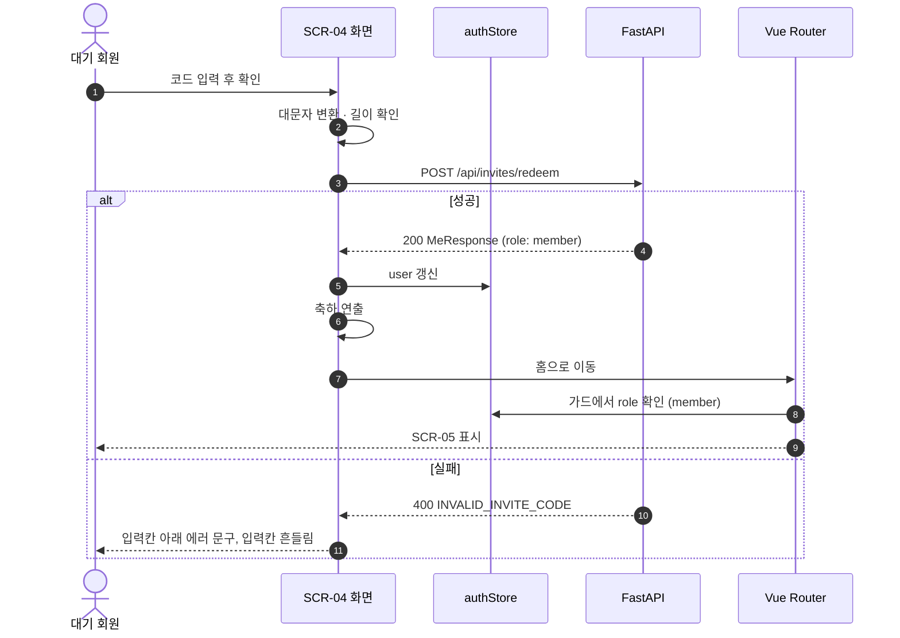

### SCR-05 홈 대시보드 (`/`, 회원)

**목적**: 로그인하자마자 전체 현황을 보고, 바로 링크를 만들 수 있게 한다.

```
[앱 헤더]
------------------------------------------------------------
 안녕하세요, 민규 님

 [ CMP-02 링크 생성 폼 ]

 +------------+  +------------+  +------------+
 | 전체 링크    |  | 전체 클릭    |  | 최근 7일    |
 |    23      |  |   5,120    |  |    431     |
 +------------+  +------------+  +------------+

 이번 주 인기 링크                          [전체 보기 →]
 1. kkok/aB3xK9q   github.com/minkyu/kkok       210
 2. ...
------------------------------------------------------------
```

| 항목 | 내용 |
|---|---|
| 호출 API | `GET /api/dashboard/summary`, 생성 시 `POST /api/links` |
| 숫자 카드 | 처음 나타날 때 0부터 숫자가 올라가는 연출 |
| 인기 링크 | 누르면 SCR-08 |
| 링크 생성 후 | 대시보드 요약을 다시 불러와 숫자 반영 |
| 빈 상태 | 링크가 0개면 숫자 카드 대신 CMP-04 빈 상태 |
| 2단계 | 이 화면이 없으므로 `/` 접속 시 SCR-06으로 이동 |

### SCR-06 내 링크 목록 (`/links`)

```
[앱 헤더]
------------------------------------------------------------
 내 링크                                    [+ 새 링크]
 [🔍 검색              ] [상태: 전체 ▾] [정렬: 최신순 ▾]

 데스크톱: 표
 | 짧은 주소        | 원래 주소                | 클릭 | 상태 | 만든 날 |   |
 | kkok/aB3xK9q 📋 | github.com/minkyu/kkok  | 210 | [●] | 9/17   | ⋯ |

 모바일: 카드
 +--------------------------------------+
 | kkok/aB3xK9q  📋             [●]     |
 | github.com/minkyu/kkok               |
 | 클릭 210 · 9/17                  ⋯    |
 +--------------------------------------+

                 < 1  2  3 >
------------------------------------------------------------
```

| 요소 | 부품 | 동작 |
|---|---|---|
| 새 링크 | Button → Dialog | Dialog 안에 CMP-02. 생성 성공 시 목록 맨 위에 추가 |
| 검색 | Input | 입력이 멈추고 0.3초 뒤 검색 (매 글자마다 요청하지 않음) |
| 상태 · 정렬 | Select | 변경 시 1페이지부터 다시 조회 |
| 짧은 주소 | 텍스트 + 복사 버튼 | 행 클릭은 SCR-08, 복사 버튼 클릭은 복사만 |
| 상태 스위치 | Switch | 켜기/끄기 즉시 반영 |
| 더보기 ⋯ | DropdownMenu | 상세 보기, 원래 주소 열기, 삭제(CMP-03) |
| 페이지 | Pagination | 20개씩 |
| 목록 | Table / Card | `md` 이상 표, 미만 카드 |

| 항목 | 내용 |
|---|---|
| 호출 API | `GET /api/links`, `POST /api/links`, `PATCH /api/links/{id}`, `DELETE /api/links/{id}` |
| 주소 쿼리 | 검색어 · 상태 · 정렬 · 페이지를 쿼리에 저장 (`/links?q=git&page=2`) |
| 스위치 처리 | **먼저 화면을 바꾸고** 요청, 실패하면 원래대로 되돌리고 알림 (낙관적 업데이트) |
| 삭제 처리 | 성공 후 행이 접히며 사라짐 |

#### 링크 켜기 · 끄기 시퀀스 (낙관적 업데이트)

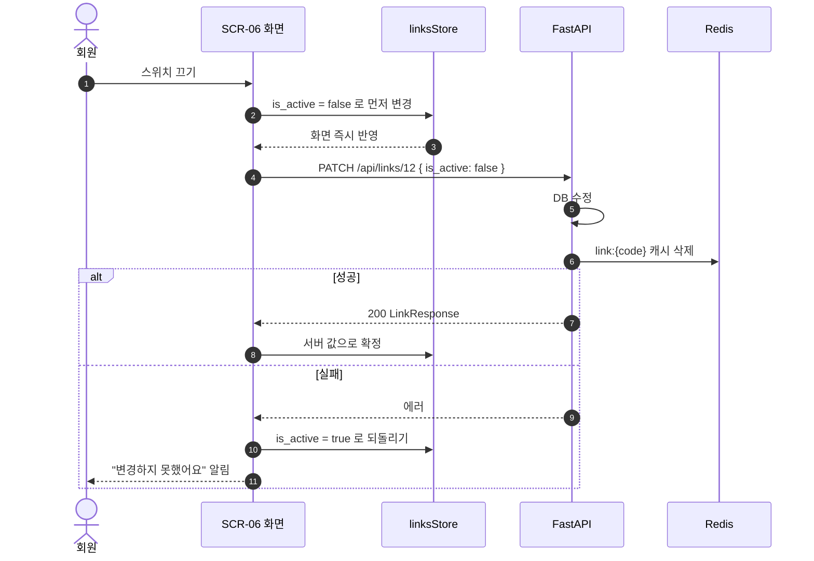

> **낙관적 업데이트**는 식당에서 주문 받자마자 "네, 됩니다!" 하고 주방 확인은 뒤에서 하는 방식이다. 대부분 성공하는 작업이라 화면이 빠르게 느껴진다. 대신 실패하면 **반드시 되돌리는 처리**가 있어야 한다.

### SCR-08 링크 상세 · 통계 (`/links/:id`)

```
[앱 헤더]
------------------------------------------------------------
 ← 내 링크
 kkok.example/aB3xK9q  [📋 복사] [QR]        [●켜짐]  [⋯]
 → https://github.com/minkyu/kkok
 만든 날 2026-09-17

 [CMP-05 기간 필터]

 +----------+ +----------+ +----------+ +----------------+
 | 전체 클릭  | | 기간 클릭  | | 오늘      | | 마지막 클릭      |
 +----------+ +----------+ +----------+ +----------------+

 클릭 추이                                  [일별 | 시간별]
 [ 선 차트 ........................................ ]

 +------------------------+ +------------------------+
 | 기기                    | | 유입 경로                |
 | [ 도넛 차트 ]            | | [ 가로 막대 차트 ]        |
 +------------------------+ +------------------------+
 +------------------------+ +------------------------+
 | 브라우저                 | | 운영체제                 |
 +------------------------+ +------------------------+

 요일 × 시간대 (선택)
 [ 히트맵 ........................................ ]
------------------------------------------------------------
```

| 영역 | 호출 API | 차트 종류 |
|---|---|---|
| 링크 정보 | `GET /api/links/{id}` | - |
| 요약 숫자 | `GET .../stats/summary` | 숫자 카드 |
| 클릭 추이 | `GET .../stats/timeseries` | 선 차트 |
| 기기 | `GET .../stats/breakdown?by=device` | 도넛 |
| 유입 경로 | `GET .../stats/breakdown?by=referrer` | 가로 막대 |
| 브라우저 · OS | `GET .../stats/breakdown?by=browser` / `os` | 가로 막대 |
| 히트맵 | `GET .../stats/heatmap` | 히트맵 |

| 항목 | 내용 |
|---|---|
| 없는 링크 | `LINK_NOT_FOUND` → "링크를 찾을 수 없어요" + [내 링크로] |
| 차트 로딩 | 영역마다 **따로** Skeleton 표시 |
| 차트 에러 | 실패한 영역에만 CMP-04 에러 + [다시 시도]. 다른 차트는 정상 표시 |
| 클릭 0 | 차트 대신 "아직 클릭이 없어요. 링크를 공유해 보세요" + 복사 버튼 |
| 시간별 보기 | 기간이 7일을 넘으면 비활성화하고 이유를 툴팁으로 표시 |
| 다크모드 | 차트 색상도 테마 변수에서 읽어 함께 전환 |
| 2단계 | 통계 영역 대신 "통계는 곧 준비돼요" 표시, 링크 정보 · 켜기/끄기 · 삭제만 제공 |

#### 통계 화면 진입 · 필터 변경 시퀀스

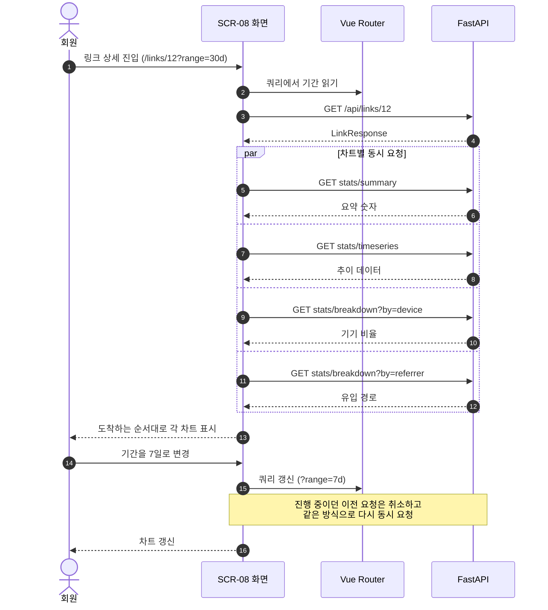

- 기간을 빠르게 여러 번 바꾸면 **늦게 도착한 옛날 응답이 새 결과를 덮어쓰는** 문제가 생긴다. 이전 요청을 취소(`AbortController`)하거나, 마지막 요청의 응답만 반영한다.

### SCR-09 계정 설정 (`/settings`)

```
[앱 헤더]
------------------------------------------------------------
 계정 설정

 프로필
   이름   민규
   이메일 minkyu@example.com

 로그인 방법
   이메일 · 비밀번호   사용 중        [비밀번호 변경]
   GitHub (@minkyu)   연결됨          [연결 해제]

 로그인한 기기 (선택)
   Chrome · Windows   현재 기기
   Safari · iOS       2일 전 사용     [로그아웃]
------------------------------------------------------------
```

| 요소 | 호출 API | 비고 |
|---|---|---|
| 프로필 | `GET /api/auth/me` (authStore 값 사용) | |
| 비밀번호 변경 | `PATCH /api/auth/password` | Dialog. 비밀번호가 없으면 "비밀번호 설정"으로 표시하고 이메일도 입력받음 |
| GitHub 연결 | `/api/auth/github/connect` **페이지 이동** | 연결 안 된 경우에만 표시 |
| GitHub 해제 | `DELETE /api/auth/github` | 비밀번호가 없으면 버튼 비활성 + "비밀번호를 먼저 설정해 주세요" 안내 |
| 기기 목록 | `GET /api/auth/sessions` | 선택 기능 |
| 기기 로그아웃 | `DELETE /api/auth/sessions/{id}` | 현재 기기는 버튼 없음 |

| 쿼리 | 표시 |
|---|---|
| `?connected=github` | "GitHub을 연결했어요" 알림 |
| `?error=github_already_linked` | "이 GitHub 계정은 다른 콕 계정에 연결돼 있어요" 알림 |

- 알림을 보여준 뒤 쿼리를 주소에서 지운다. (새로고침 시 알림이 또 뜨지 않게)

#### GitHub 계정 연결 시퀀스

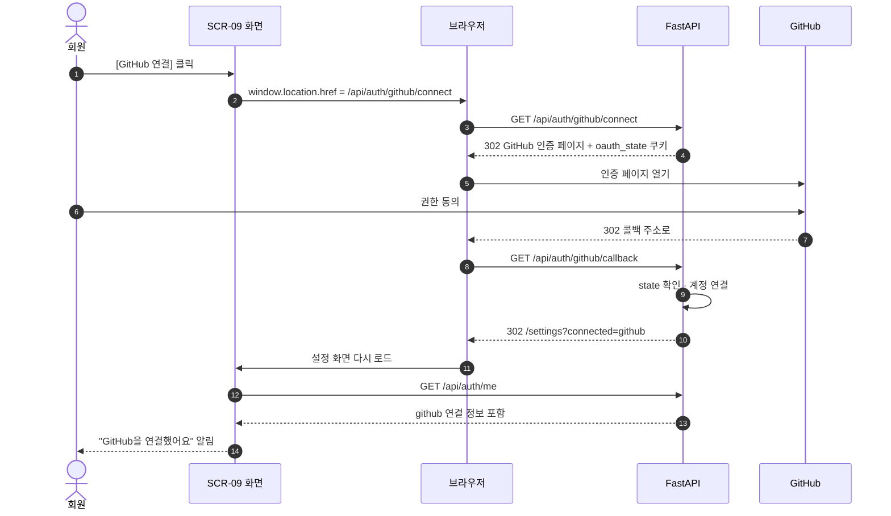

- 이 흐름은 **Vue 앱이 한 번 완전히 떠났다가 돌아온다.** 그래서 앱 시작 흐름(5장)이 다시 실행된다.

### SCR-10 초대 코드 관리 (`/admin/invites`)

```
[앱 헤더]
------------------------------------------------------------
 초대 코드                                  [+ 코드 발급]
 [전체 | 미사용 | 사용됨 | 만료]

 | 코드        | 메모         | 상태   | 사용자 | 만료일  |      |
 | K7P2-XQ9M  | 대학 동기 지훈 | 미사용 |   -   | 9/24   | 📋   |
 | M3NA-7TQZ  | 회사 동료     | 사용됨 | 수아   | 9/20   |      |
------------------------------------------------------------

(발급 Dialog)
 메모        [                    ]
 유효 기간   [7일 ▾]
             [취소]  [발급하기]

(발급 결과)
 🎟 K7P2-XQ9M                [📋 복사]
 초대 문구 복사:
 "콕 초대 코드: K7P2-XQ9M (9/24까지) → kkok.example/signup"
                                    [📋 문구 복사]
```

| 항목 | 내용 |
|---|---|
| 호출 API | `GET /api/admin/invites`, `POST /api/admin/invites` |
| 상태 배지 | 미사용(기본색) · 사용됨(초록) · 만료(회색). **글자로도 상태 표시** |
| 초대 문구 복사 | 코드 · 만료일 · 가입 주소를 한 번에 복사해 메신저로 바로 보낼 수 있게 |

#### 초대 코드 발급 시퀀스

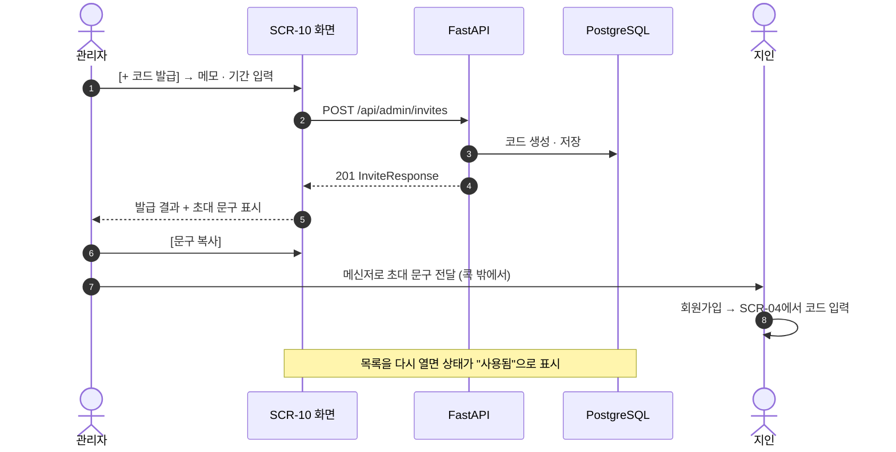

### SCR-11 회원 관리 (`/admin/users`)

```
[앱 헤더]
------------------------------------------------------------
 회원 관리
 [🔍 이름 · 이메일] [권한: 전체 ▾] [상태: 전체 ▾]

 | 이름 | 이메일          | 권한 | 로그인 방법    | 링크 | 최근 로그인 | 상태 | ⋯ |
 | 지훈 | jihoon@...     | 회원 | 🔑 GitHub     |  4  | 9/16      | 정상 | ⋯ |
------------------------------------------------------------
 ⋯ 메뉴: 정지 / 정지 해제 / 임시 비밀번호 발급
```

| 요소 | 호출 API | 비고 |
|---|---|---|
| 목록 | `GET /api/admin/users` | |
| 정지 · 해제 | `PATCH /api/admin/users/{id}` | 확인 Dialog: "정지하면 모든 기기에서 로그아웃돼요" |
| 임시 비밀번호 | `POST /api/admin/users/{id}/reset-password` | 결과 Dialog에서 **한 번만** 표시 + 복사. 닫으면 다시 볼 수 없다고 안내 |
| 관리자 본인 행 | - | ⋯ 메뉴 비활성 |
| 대기 회원 | - | 권한 칸에 "대기" 배지 |

### SCR-12 안내 페이지 (`/notice/:type`)

| type | 제목 | 설명 | 버튼 |
|---|---|---|---|
| `not-found` | 링크를 찾을 수 없어요 | 주소가 정확한지 확인해 주세요. | [콕 홈으로] |
| `inactive` | 지금은 쉬고 있는 링크예요 | 링크를 만든 사람이 잠시 꺼두었어요. | [콕 홈으로] |
| `expired` | 기간이 끝난 링크예요 | 유효 기간이 지나 더 이상 이동할 수 없어요. (4단계) | [콕 홈으로] |
| `page-not-found` | 페이지를 찾을 수 없어요 | 콕 안의 없는 화면에 접근했을 때 | [홈으로] |

```
            👆 (고개 갸웃하는 손가락 일러스트)
         링크를 찾을 수 없어요
     주소가 정확한지 확인해 주세요.
             [콕 홈으로]
```

- 호출 API 없음
- 짧은 링크를 누른 **외부 방문자**가 주로 보게 되는 화면이다. 콕을 모르는 사람이 봐도 무슨 상황인지 알 수 있게 쓴다.

### SCR-13 · 14 · 15 계정 복구 (4단계)

| 화면 | 구성 | 호출 API |
|---|---|---|
| SCR-13 비밀번호 찾기 | 이메일 입력 → "메일을 보냈어요" (가입 여부와 상관없이 같은 문구) | `POST /api/auth/password-reset/request` |
| SCR-14 비밀번호 재설정 | 새 비밀번호 입력. 주소의 `?token=` 사용 | `POST /api/auth/password-reset/confirm` |
| SCR-15 이메일 인증 결과 | 진입 즉시 인증 요청 → 성공 / 실패 안내 | `POST /api/auth/email-verification/confirm` |

- 토큰은 화면에 들어오자마자 **주소창에서 지운다.** (화면 공유 · 스크린샷으로 노출 방지)

---

## 8. 프론트엔드 파일 배치

| 화면 | 파일 (`frontend/src/pages/`) |
|---|---|
| SCR-01 | `LandingPage.vue` |
| SCR-02 | `auth/LoginPage.vue` |
| SCR-03 | `auth/SignupPage.vue` |
| SCR-04 | `auth/InvitePage.vue` |
| SCR-05 | `DashboardPage.vue` |
| SCR-06 | `links/LinkListPage.vue` |
| SCR-08 | `links/LinkDetailPage.vue` |
| SCR-09 | `SettingsPage.vue` |
| SCR-10 | `admin/InviteAdminPage.vue` |
| SCR-11 | `admin/UserAdminPage.vue` |
| SCR-12 | `NoticePage.vue` |
| SCR-13~15 | `account/*.vue` |

| 부품 | 파일 (`frontend/src/components/`) |
|---|---|
| CMP-01 | `layout/AppHeader.vue` |
| CMP-02 | `links/LinkCreateForm.vue`, `links/LinkResultCard.vue` |
| CMP-03 | `links/LinkDeleteDialog.vue` |
| CMP-04 | `common/EmptyState.vue`, `common/ErrorState.vue` |
| CMP-05 | `stats/PeriodFilter.vue` |
| 차트 | `stats/ClickTrendChart.vue`, `stats/BreakdownChart.vue`, `stats/HeatmapChart.vue` |

- 차트 부품은 **차트 라이브러리를 감싸는 얇은 껍데기**로 만든다. 나중에 ECharts ↔ ApexCharts를 바꿔도 화면 코드는 그대로 두고 이 파일들만 고치면 된다.

---

## 9. 단계별 화면 구현 순서

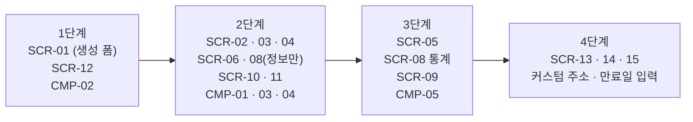

- 1단계에서 다크모드와 반응형 기본 틀(색상 변수, 레이아웃)을 먼저 잡아둔다. 화면이 늘어난 뒤에 넣으면 전부 다시 손봐야 한다.

---

## 10. 결정 기록

| 항목 | 결정 | 이유 |
|---|---|---|
| 첫 화면 | 역할별로 다름 (랜딩 / 초대 코드 / 대시보드) | 로그인 상태에 맞는 할 일을 바로 보여줌 |
| 앱 시작 | 로그인 확인 전 전체 로딩 표시 | 화면 깜빡임 방지 |
| 필터 · 검색 상태 | 주소 쿼리에 저장 | 새로고침 · 공유해도 유지 |
| 켜기/끄기 | 낙관적 업데이트 | 자주 쓰는 조작을 빠르게 |
| 통계 로딩 | 차트별 개별 로딩 · 에러 | 하나가 실패해도 나머지는 보임 |
| 차트 부품 | 라이브러리를 감싸서 사용 | 라이브러리 교체 대비 |
| 4단계 계정 화면 | `/account/...` 두 단계 경로 | 예약어를 `account` 하나로 해결 |
| 로그인 후 이동 | 내부 경로만 허용 | 외부 사이트로 튕기는 공격 방지 |
| 테마 저장 | localStorage | 토큰이 아닌 단순 설정값 |

---

## 11. 남은 미정 사항

- [x] ~~색상 팔레트 · 폰트~~ → 코랄 오렌지 `#FF6B4A` + Pretendard, shadcn-vue 기본 테마 위에 적용 (1장)
- [ ] 차트 라이브러리 최종 선택 (ECharts vs ApexCharts)
- [ ] 손가락 로고 · 일러스트 제작 방식
- [ ] QR 코드 기능 포함 여부
- [ ] 로그인 기기 관리 · 히트맵 포함 여부 (3단계 선택 기능)
